# EMIC LoRa Critical Flows Documentation

**Phiên bản:** 1.0.0  
**Ngày:** 20 Tháng 1, 2026  
**Mục đích:** Flowcharts cho các luồng logic quan trọng

---

## 📚 Related Documents

- [software_architecture.md](software_architecture.md) - System architecture
- [state_machines.md](state_machines.md) - State machine definitions
- [layer_call_flow.md](layer_call_flow.md) - Call flow diagrams

---

## 1. Main Loop Flow

### 1.1. Super-Loop Flowchart

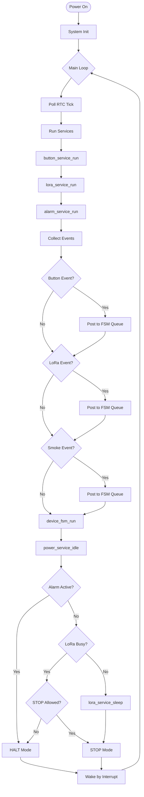

### 1.2. Timing Budget (per iteration)

| Phase            | Duration   | Purpose                     |
|------------------|------------|-----------------------------|
| button_service   | ~1 ms      | Debounce, gesture detect    |
| lora_service     | ~5-10 ms   | MAC state, radio poll       |
| alarm_service    | ~1 ms      | LED/buzzer update           |
| device_fsm_run   | ~0.5 ms    | Event processing            |
| power_service    | ~0.2 ms    | Sleep decision              |
| **Total active** | **~8-13 ms**| Per loop iteration         |
| Sleep (STOP)     | Variable   | 0.5s - 5s (wake by RTC)     |

---

## 2. Join Procedure Flow

### 2.1. Join Flowchart (ED Side)

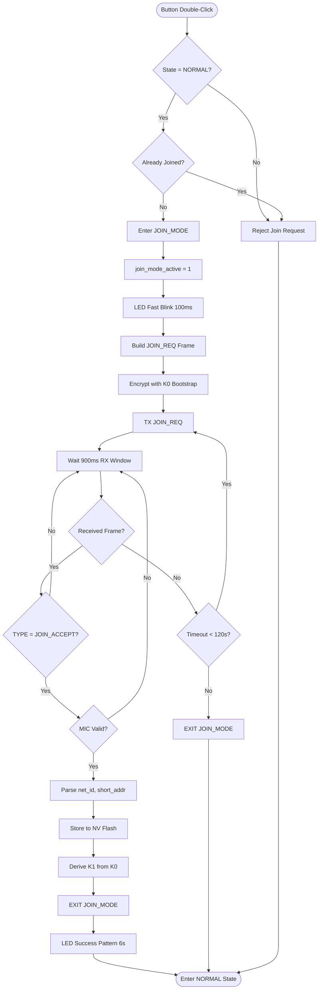

### 2.2. Join Acceptance Criteria

| Check              | Condition                       | Action if Fail      |
|--------------------|---------------------------------|---------------------|
| Frame TYPE         | Must be `JOIN_ACCEPT`           | Ignore frame        |
| MIC verification   | Must match with K0              | Reject silently     |
| Payload length     | Must be >= 10 bytes             | Reject              |
| net_id             | Must be valid (not 0xFFFFFFFF)  | Reject              |
| short_addr         | Must be in ED range (0x0100-0xFFFD) | Reject          |

---

## 3. Alarm Propagation Flow

### 3.1. Local Alarm Flowchart

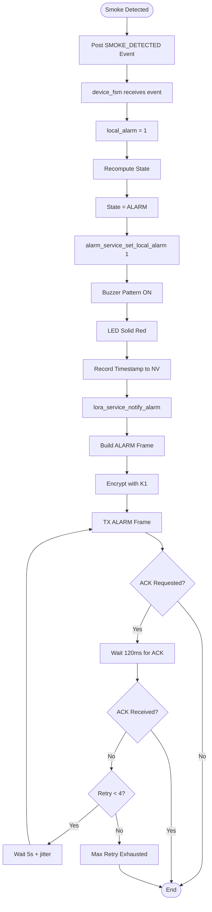

### 3.2. Remote Alarm Flowchart

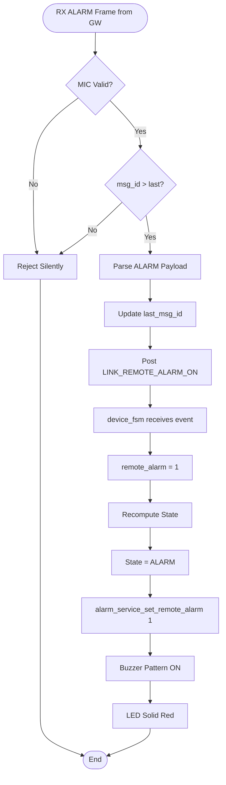

### 3.3. GW Backbone Mesh Flow (GW Only)

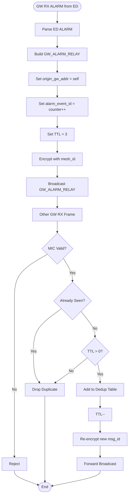

---

## 4. Retry Logic Flow

### 4.1. Exponential Backoff Flowchart

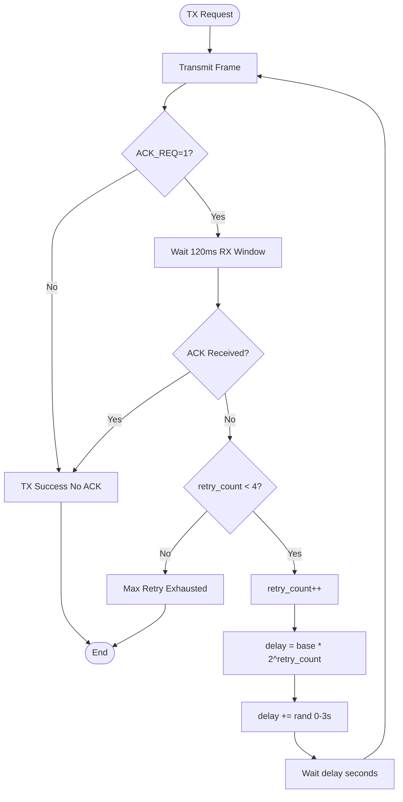

### 4.2. Retry Parameters

| Retry Attempt | Base Delay | Jitter    | Total Delay Range |
|---------------|------------|-----------|-------------------|
| 1st (initial) | 0 s        | -         | Immediate         |
| 2nd           | 5 s        | 0-3 s     | 5-8 s             |
| 3rd           | 10 s       | 0-3 s     | 10-13 s           |
| 4th           | 20 s       | 0-3 s     | 20-23 s           |
| 5th           | -          | -         | Give up           |

---

## 5. Beacon Sync Flow (Future Feature)

### 5.1. Beacon RX Window Scheduling

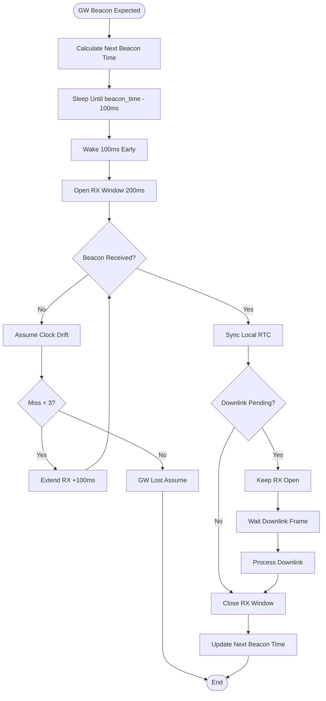

---

## 6. Error Handling Flows

### 6.1. MIC Failure Flow

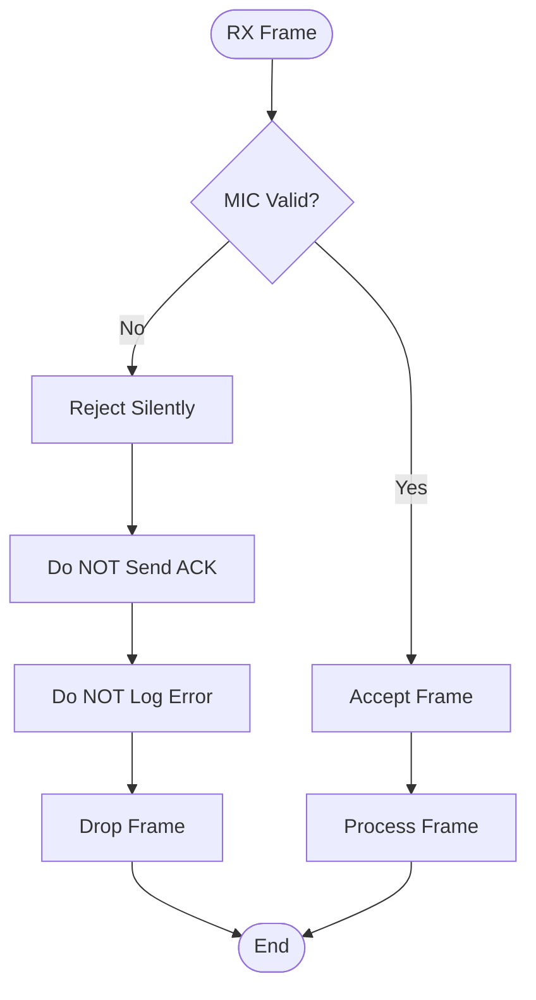

### 6.2. Replay Attack Flow

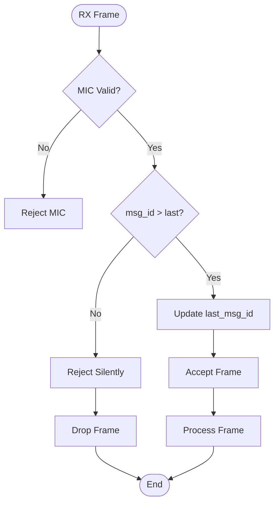

---

## 7. Power Mode Transitions

### 7.1. Sleep Decision Flowchart

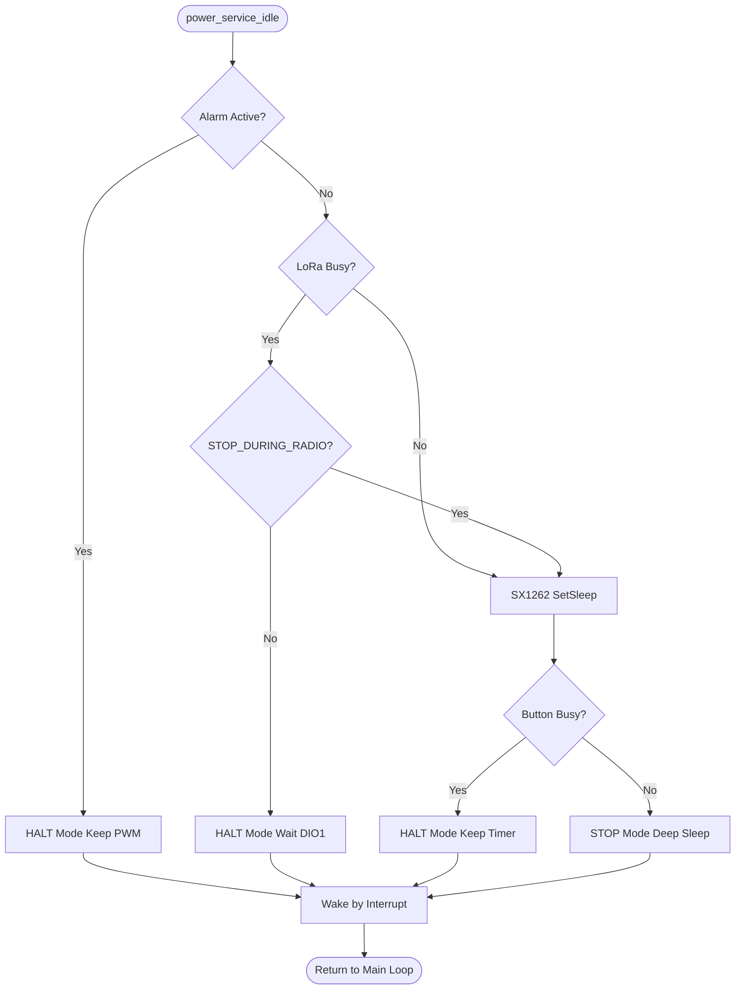

### 7.2. Power Mode Current Draw

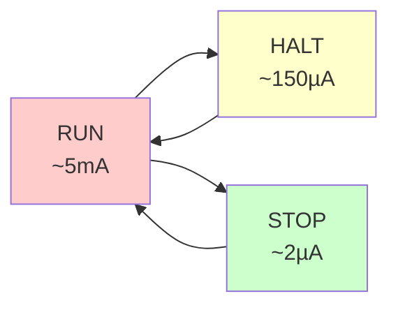

---

## 8. Frame Processing Flows

### 8.1. TX Frame Build Flow

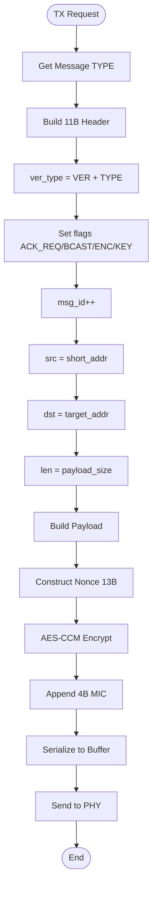

### 8.2. RX Frame Parse Flow

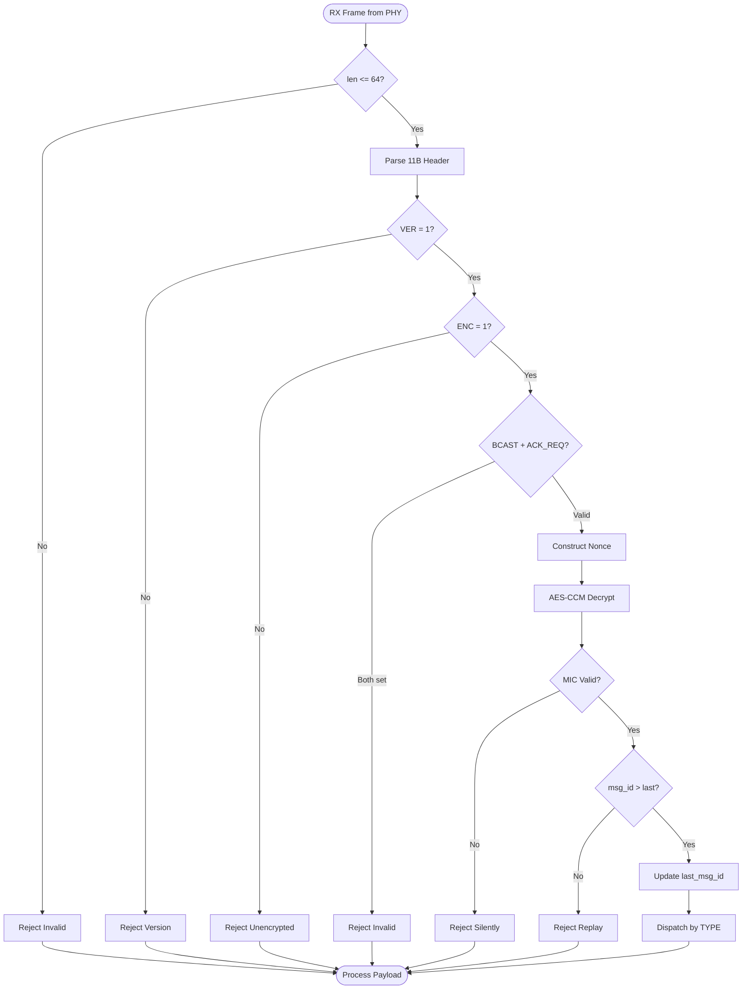

---

## 9. Critical Timing Diagrams

### 9.1. CAD → RX → TX ACK Timing

```
Timeline (ms):
0        12      132     182     232
|--------|-------|-------|-------|
  CAD      RX      TX      IDLE
  (12ms)  (120ms) (50ms)
  
Events:
0ms:   Start CAD
12ms:  CAD Positive → Open RX
132ms: RX Done (frame received)
       Parse frame, build ACK
182ms: TX ACK complete
232ms: Return IDLE
```

### 9.2. Heartbeat TX → RX ACK Timing

```
Timeline (ms):
0       50      170     290
|-------|-------|-------|
  TX      WAIT    RX
  (50ms)  (120ms) (120ms)
  
Events:
0ms:   TX HEARTBEAT
50ms:  TxDone → Wait ACK
170ms: Open RX window
290ms: RX Done (ACK received) or timeout
```

---

## 10. Flowchart Conventions

### 10.1. Symbol Legend

| Symbol | Meaning                | Example                     |
|--------|------------------------|-----------------------------|
| ([ ])  | Start/End (terminator) | ([Power On])                |
| [ ]    | Process (action)       | [Build Frame]               |
| { }    | Decision (conditional) | {MIC Valid?}                |
| [/ /]  | Input/Output           | [/RX Frame from PHY/]       |

### 10.2. Color Coding

- 🟢 **Green:** Success path
- 🔴 **Red:** Error/reject path
- 🟡 **Yellow:** Retry/fallback path
- 🔵 **Blue:** Normal flow path

---

## 11. Future Flow Additions

### 11.1. Planned Flowcharts

- [ ] OTA Firmware Update Flow
- [ ] Multi-Channel Frequency Hopping
- [ ] Mesh Route Discovery (AODV-like)
- [ ] Sleep Scheduling Coordination

---

**Document Status:** ✅ Ready for Review  
**Next Review:** 2026-02-20
