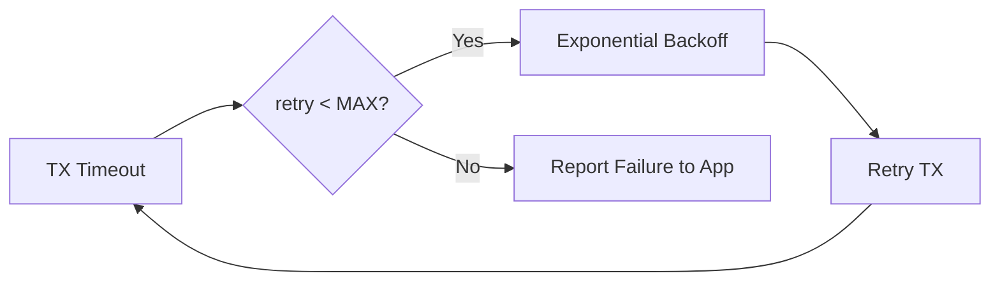

# EMIC LoRa Error Handling Guide

**Phiên bản:** 1.0.0  
**Ngày:** 20 Tháng 1, 2026  
**Mục đích:** Error taxonomy, handling strategies, recovery procedures

---

## 1. Error Taxonomy

### 1.1. Error Categories

| Category          | Layer      | Examples                           | Severity   | Recovery Strategy    |
|-------------------|------------|------------------------------------|------------|----------------------|
| **Security**      | Protocol   | MIC fail, replay attack            | CRITICAL   | Silent reject        |
| **Communication** | MAC        | TX timeout, ACK missing            | HIGH       | Retry with backoff   |
| **Hardware**      | HAL        | SPI fail, radio hang               | CRITICAL   | Reset subsystem      |
| **Data**          | Storage    | NV write fail, CRC error           | HIGH       | Retry, use backup    |
| **Logic**         | Application| Invalid state transition           | MEDIUM     | Recompute state      |
| **Resource**      | System     | Queue full, buffer overflow        | MEDIUM     | Drop, log warning    |

---

## 2. Security Errors

### 2.1. MIC Verification Failure

**Cause:** Frame tampered or wrong key

**Detection:**
```c
if (!emic_lora_verify_mic(frame, key)) {
    // MIC fail
}
```

**Handler:**
- ❌ DO NOT send ACK
- ❌ DO NOT log (prevent side-channel)
- ✅ Drop frame silently
- ✅ Increment stat counter (optional)

### 2.2. Replay Attack

**Cause:** `msg_id <= last_msg_id`

**Handler:**
- ❌ DO NOT process frame
- ✅ Drop silently
- ✅ Log in debug mode only

### 2.3. Invalid Encryption

**Cause:** ENC flag not set

**Handler:**
- Reject frame immediately
- Log error (debug)

---

## 3. Communication Errors

### 3.1. TX Timeout

**Cause:** Radio TX fails

**Error code:** `TX_TIMEOUT`

**Recovery:**


**Max retries:** 4  
**Backoff:** 5s, 10s, 20s

### 3.2. ACK Missing

**Cause:** No ACK received within 120ms

**Recovery:**
- Same as TX timeout (retry with backoff)
- After 4 retries → report failure

### 3.3. CRC Error (PHY Layer)

**Cause:** RF interference

**Handler:**
- Drop frame
- Radio automatically re-enters RX
- No retry needed (receiver-side error)

---

## 4. Hardware Errors

### 4.1. SPI Communication Failure

**Symptoms:** sx1262_read_register returns 0xFF

**Recovery:**
```c
uint8_t retry = 0;
while (retry < 3) {
    if (sx1262_check_device_ready()) break;
    retry++;
    delay_ms(10);
}
if (retry >= 3) {
    radio_reset();  // Hard reset
}
```

### 4.2. Radio Hang Detection

**Symptoms:** No DIO1 interrupt after SetTx

**Watchdog timer:** 5 seconds

**Recovery:**
```c
if (tx_duration > 5000ms) {
    sx1262_reset();
    radio_if_init();  // Re-init
}
```

### 4.3. Dataflash Write Failure

**Cause:** Dataflash full or worn out

**Handler:**
- Retry 3 times
- If fail → use RAM backup
- Log critical error
- Disable NV writes (volatile mode)

---

## 5. Data Errors

### 5.1. Invalid Frame Length

**Check:** `len > 49` or `len > actual_received`

**Handler:**
```c
if (len > MAX_PAYLOAD_LEN) {
    return ERROR_INVALID_LENGTH;
}
```

### 5.2. Malformed Payload

**Cause:** TYPE doesn't match payload structure

**Handler:**
- Log error (debug)
- Drop frame
- Send NACK (optional)

### 5.3. NV Store Corruption

**Detection:** CRC mismatch on read

**Recovery:**
```c
if (nv_crc_check() != OK) {
    nv_restore_factory_defaults();
    request_rejoin();  // Force re-join
}
```

---

## 6. Logic Errors

### 6.1. Invalid State Transition

**Example:** ALARM → JOIN_MODE (not allowed)

**Handler:**
```c
if (s_state == DEVICE_STATE_ALARM && 
    ev == DEVICE_EVENT_BTN_JOIN_MODE_ENTER) {
    log_warn("Join blocked during ALARM");
    return;  // Ignore event
}
```

### 6.2. Event Queue Overflow

**Cause:** 8+ events pending

**Handler:**
```c
if (s_q_count >= QUEUE_CAPACITY) {
    log_warn("Event queue full, dropping event");
    return DEVICE_FSM_POST_DROPPED;
}
```

---

## 7. Resource Errors

### 7.1. Buffer Overflow

**Prevention:**
```c
#define FRAME_BUFFER_SIZE 64

if (len + header_size + mic_size > FRAME_BUFFER_SIZE) {
    return ERROR_BUFFER_OVERFLOW;
}
```

### 7.2. Stack Overflow

**Detection:** Compile-time check + runtime canary

**Prevention:**
- Limit recursion depth
- Use fixed-size buffers
- Monitor stack usage (debug builds)

---

## 8. Error Reporting

### 8.1. Error Codes

```c
typedef enum {
    ERR_OK = 0,
    ERR_MIC_FAIL = -1,
    ERR_REPLAY = -2,
    ERR_TX_TIMEOUT = -3,
    ERR_NO_ACK = -4,
    ERR_INVALID_LENGTH = -5,
    ERR_BUFFER_OVERFLOW = -6,
    ERR_RADIO_HANG = -7,
    ERR_NV_WRITE_FAIL = -8,
    ERR_CRC_FAIL = -9,
    ERR_UNKNOWN = -99
} error_code_t;
```

### 8.2. Error Statistics

```c
struct error_stats {
    uint16_t mic_fail_count;
    uint16_t replay_count;
    uint16_t tx_timeout_count;
    uint16_t no_ack_count;
    uint16_t radio_reset_count;
};
```

### 8.3. Error Logging

**Debug mode:**
```c
#ifdef DEBUG_BUILD
  log_error("[ERR] MIC fail from 0x%04X", src_addr);
#endif
```

**Production mode:**
- Increment counter only
- No UART logging (save power)

---

## 9. Watchdog & Failsafe

### 9.1. Watchdog Timer

**Timeout:** 8 seconds (configurable)

**Reset conditions:**
- Main loop hang
- ISR infinite loop
- Radio driver hang

**Handler:**
```c
void wdt_init() {
    WDTIMR = 0x7F;  // 8s timeout
}

void wdt_refresh() {
    WDTE = 0xAC;  // Magic value to reset
}
```

### 9.2. Brownout Detection

**Threshold:** 2.4V

**Handler:**
- Save critical data to NV
- Enter low-power mode
- Disable radio TX (save battery)

---

## 10. Error Recovery Matrix

| Error Type         | Immediate Action  | Short-term Recovery    | Long-term Fallback   |
|--------------------|-------------------|------------------------|----------------------|
| MIC fail           | Drop silently     | -                      | -                    |
| Replay             | Drop silently     | -                      | -                    |
| TX timeout         | Retry (4x)        | Exponential backoff    | Report failure       |
| No ACK             | Retry (4x)        | Exponential backoff    | Report failure       |
| Radio hang         | Reset radio       | Re-init PHY            | Hard MCU reset (WDT) |
| SPI fail           | Retry (3x)        | Reset SPI peripheral   | Reset radio          |
| NV write fail      | Retry (3x)        | Use RAM backup         | Factory reset        |
| Queue overflow     | Drop event        | Log warning            | -                    |
| Stack overflow     | -                 | -                      | Hard reset (WDT)     |

---

## 11. Defensive Programming

### 11.1. Input Validation

```c
// Always validate pointers
if (ptr == NULL) return ERR_INVALID_PARAM;

// Validate ranges
if (len > MAX_LEN) return ERR_INVALID_LENGTH;

// Validate state
if (state != EXPECTED) return ERR_INVALID_STATE;
```

### 11.2. Assert Macros

```c
#ifdef DEBUG_BUILD
  #define ASSERT(cond) if(!(cond)) { while(1); }
#else
  #define ASSERT(cond) if(!(cond)) { RESET(); }
#endif
```

### 11.3. Bounds Checking

```c
// Array access
if (index >= ARRAY_SIZE) return ERR_OUT_OF_BOUNDS;

// Buffer write
if (offset + size > BUFFER_SIZE) return ERR_OVERFLOW;
```

---

## 12. Error Testing

### 12.1. Fault Injection

**Test cases:**
- Inject MIC errors (flip random bit)
- Simulate TX timeout (disable radio)
- Force queue overflow (post 10 events)
- Corrupt NV store (flip CRC)

### 12.2. Stress Testing

- Max retry scenarios (4 retries)
- Rapid state transitions
- Continuous TX/RX (thermal stress)

---

**Document Status:** ✅ Ready for Review  
**Next Review:** 2026-02-20
