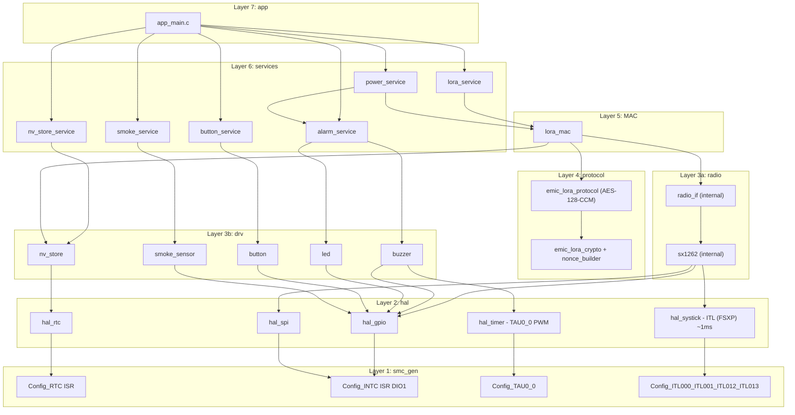
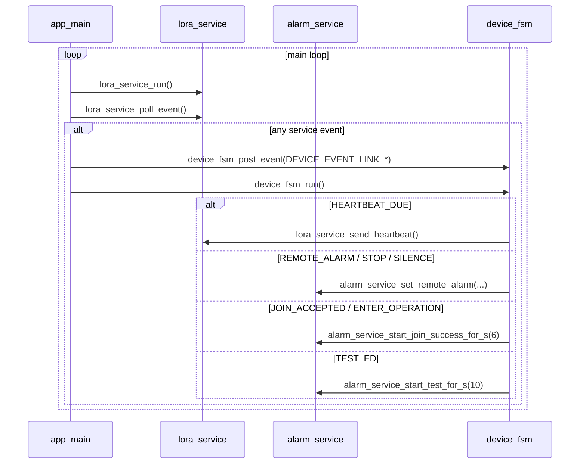
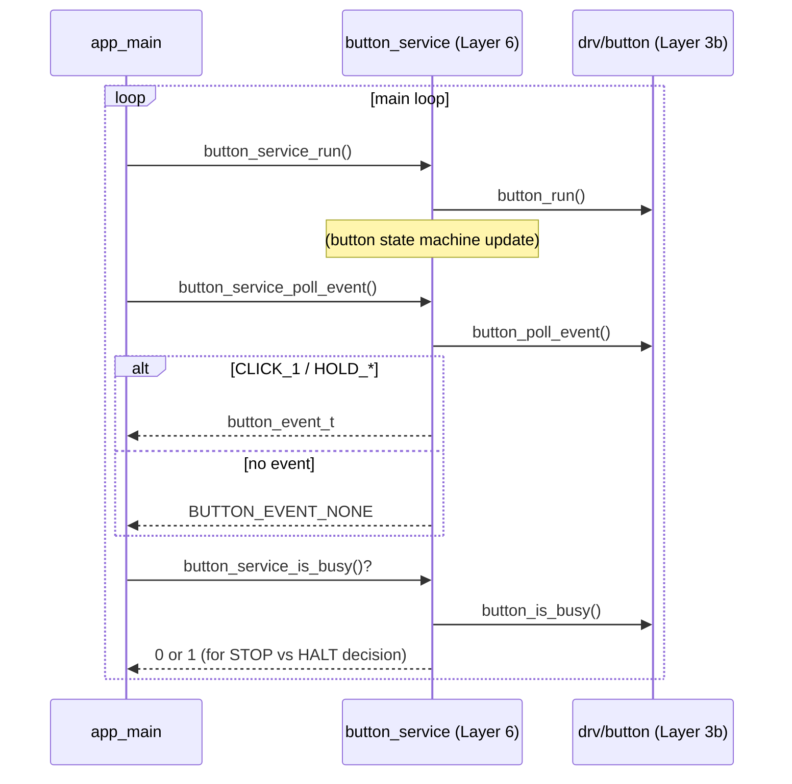
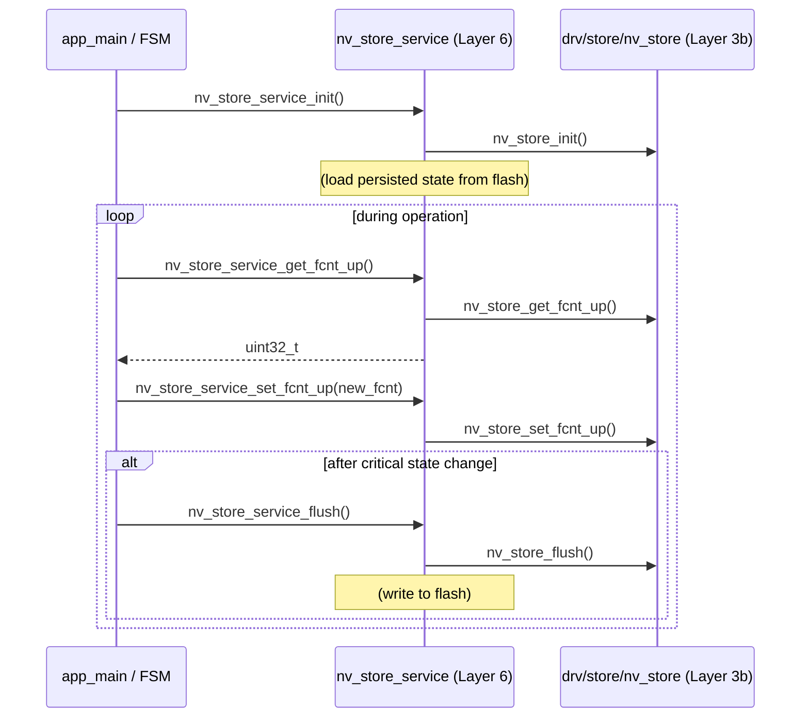
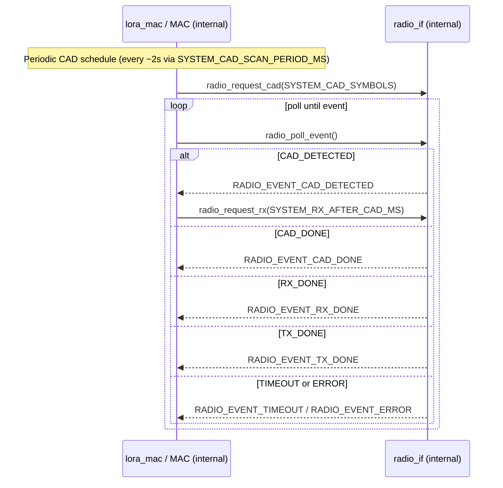
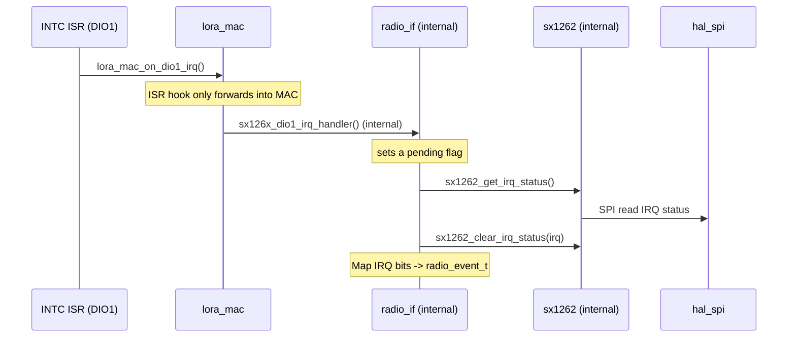
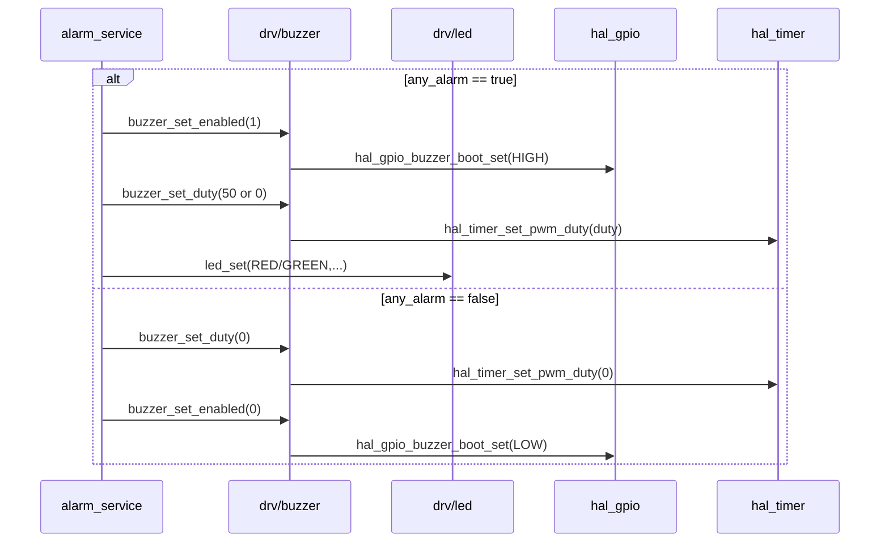
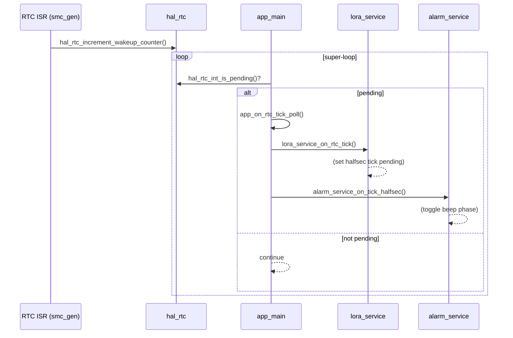
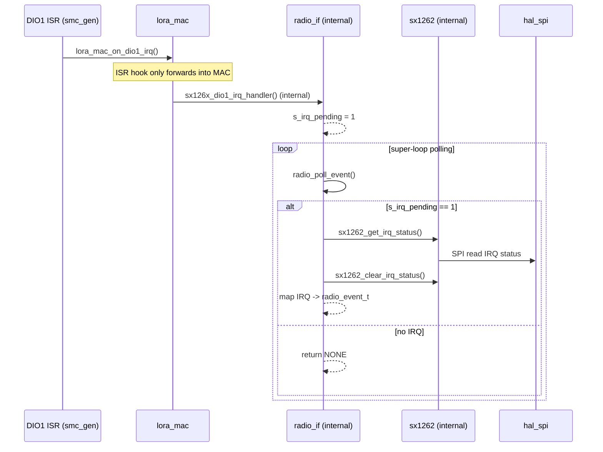

# Tổng quan luồng gọi giữa các layer (ai gọi ai)

Mục tiêu: cho cái nhìn **trực quan** về quan hệ phụ thuộc và các **điểm giao tiếp** quan trọng giữa các layer trong firmware hiện tại.

> **Tham chiếu tài liệu chuẩn:**
>
> - Kiến trúc layer: xem [emic_lora_stack_architecture.md](emic_lora_stack_architecture.md) (Mục 2-4: PHY/MAC/Protocol layers)
> - Định dạng frame & bảo mật: xem [emic_lora_protocol_frame_spec.md](emic_lora_protocol_frame_spec.md) (Mục 8-10: AES-128-CCM, anti-replay, 15 message types)
> - **Terminology:** "MAC Layer" (chứ không "Link Layer"), **"AES-128-CCM"** (Protocol layer encryption), **"msg_id"** (Protocol anti-replay counter, window=1)

---

## 1) Layer map (phụ thuộc 1 chiều)

### 1.1 Sơ đồ phụ thuộc (Dependency diagram)

### 1.2 Dependency rules (tuân thủ 1 chiều)

| Layer    | Gọi                 | Được gọi bởi |
| -------- | -------------------- | ----------------- |
| app      | services             | main()            |
| services | MAC, drv, hal        | app               |
| MAC      | radio, protocol, drv | services          |
| protocol | hal/utils (crypto)   | MAC               |
| radio    | drv, hal             | MAC (internal)    |
| drv      | hal                  | services, radio   |
| hal      | smc_gen              | (all)             |
| smc_gen  | (hw registers)       | hal               |

Ghi chú:

- Luồng phụ thuộc "đúng hướng": `app → services → MAC → radio → drv → hal → smc_gen`.
- **MAC layer** ("Link" layer cũ, được chuẩn hóa thành "MAC" theo IEEE 802.15.4) chịu trách nhiệm: frame format (10B header + payload + 4B MIC), ACK + retry, link reliability (xem [emic_lora_stack_architecture.md](emic_lora_stack_architecture.md) Mục 3).
- **Protocol layer** chịu trách nhiệm: AES-128-CCM encryption/decryption, anti-replay check (msg_id window=1, strictly monotonic), nonce construction (13 bytes), message type handling cho 15 types (xem [emic_lora_stack_architecture.md](emic_lora_stack_architecture.md) Mục 4).
- **Configuration separation**: `system_config.h` chứa RF/MAC/protocol constants dùng bởi lower layers (radio, MAC, protocol); `app_config.h` chứa application-level constants dùng bởi app và services. Lower layers **KHÔNG** include `app_config.h` để tuân thủ strict layering.
- `protocol` là thư viện logic (build/parse frame + crypto) không chạm phần cứng.
- Không được gọi "ngược lên" (ví dụ `hal` không gọi `app`).

---

## 2) Các điểm giao tiếp quan trọng (cross-layer API)

### 2.1 App ↔ Services ↔ MAC

**Tầng lora_service (Layer 6)** là facade service bọc lấy lora_mac layer, cung cấp API sạch cho app và các service khác. Nó consolidate tất cả LoRa network operations (heartbeat, join, uplink, event polling) thành một single public interface.

- `app_main.c`:

  - Mỗi vòng lặp: `button_service_run()` → `lora_service_run()` → `alarm_service_run()`.
  - Sau đó gom event từ button_service/lora_service/smoke và **post vào `device_fsm`**.
  - `device_fsm_run()` mới là nơi ra quyết định: cập nhật alarm state và gọi các trigger `lora_service_*()` tương ứng.

Các trigger từ `device_fsm` xuống lora_service:

- Heartbeat: `lora_service_send_heartbeat()` (periodic keepalive to gateway)
- Local alarm ON: `lora_service_notify_alarm()` (smoke detected / test-hold)
- Local alarm OFF: `lora_service_notify_alarm_cleared()` (smoke cleared / test release)

Các event từ `lora_service_poll_event()` (hiện tại, xem [emic_lora_protocol_frame_spec.md](emic_lora_protocol_frame_spec.md) Mục 9 cho đầy đủ 15 message types):

- `HEARTBEAT_DUE`
- `REMOTE_ALARM` (Type 0x03: ALARM)
- `REMOTE_ALARM_CLEAR` (Type 0x04: ALARM_CLEAR)
- `REMOTE_SILENCE` (Type 0x05: SIREN_SILENCE)
- `GW_LOST`
- `JOIN_ACCEPTED` (Type 0x02: JOIN_ACCEPT)
- `ENTER_OPERATION` (Type 0x06: SET_OPERATIONAL)
- `LEAVE_NETWORK` (Type 0x0B: LEAVE_NETWORK)

### 2.1.1 Button Service (Layer 6 input facade)

**Tầng button_service (Layer 6)** là facade service bọc lấy drv/button driver, cung cấp API sạch cho app.

- `app_main.c`:

  - `button_service_run()`: cập nhật button state machine, debounce, gesture detection.
  - `button_service_poll_event()`: poll event từ queue (CLICK_1/2/3/4, HOLD_1S/3S/5S).
  - `button_service_is_pressed()`: check nút smoke-test hiện tại có nhấn không.
  - `button_service_is_busy()`: check nếu đang xử lý gesture → system cần HALT (không STOP) để giữ 1ms tick.

### 2.1.2 NV Store Service (Layer 6 persistence facade)

**Tầng nv_store_service (Layer 6)** là facade service bọc lấy drv/store/nv_store driver, cung cấp API sạch cho app.

- `app_main.c`:

  - `nv_store_service_init()`: Load persisted state từ flash/EEPROM.
  - `nv_store_service_get_*()` / `nv_store_service_set_*()`: Access frame counters, device identity, config parameters.
  - `nv_store_service_factory_reset()`: Clear all persisted state (user-triggered).
  - `nv_store_service_flush()`: Ensure changes persisted to NVM.

### 2.2 MAC ↔ Radio

Ghi chú: phần này là **internal detail** của MAC layer.

- MAC yêu cầu radio thực hiện:

  - `radio_request_cad()` (CAD paging)
  - `radio_request_rx()` (RX window sau CAD)
  - `radio_request_tx()` (uplink)
- MAC tiêu thụ radio event:

  - `radio_poll_event()` trả về `CAD_DETECTED / CAD_DONE / RX_DONE / TX_DONE / TIMEOUT / ERROR`.

### 2.3 Radio ↔ SX1262 driver ↔ HAL

Ghi chú: phần này là **internal detail** của radio layer.

- `radio_if.c` giữ ISR "mỏng":

  - ISR DIO1 gọi `lora_mac_on_dio1_irq()`; bên trong MAC sẽ gọi `sx126x_dio1_irq_handler()` (internal) để set cờ `s_irq_pending`.
  - Main loop gọi `radio_poll_event()` → đọc IRQ qua SPI (`sx1262_get_irq_status()`) và map sang `radio_event_t`.
- `sx1262.c` dùng:

  - `hal_spi_*` cho SPI.
  - `hal_gpio_*` cho BUSY/RESET/CS/ANT_SW.
  - `hal_systick_delay_ms()` cho delay reset/init.

### 2.4 Services ↔ Drivers ↔ HAL (buzzer/LED/button)

- `alarm_service` điều khiển:

  - `buzzer_set_enabled()` (nguồn/gate BUZZER_BOOT)
  - `buzzer_set_duty()` (PWM duty)
  - `led_set()` (LED)
- `buzzer.c` dùng:

  - `hal_timer_set_pwm_duty()` (TAU0_0 PWM) + `hal_gpio_buzzer_boot_set()`.

---

## 3) Biên ISR (interrupt boundary) — "ai đánh thức ai"

### 3.1 RTC interrupt → main tick

### 3.2 DIO1 interrupt (SX1262) → main xử lý IRQ qua SPI

---

## 4) Ghi chú về low-power

- `alarm_service_is_active()` được hiểu là **buzzer cần chạy pattern** (giữ clock/PWM). Một số status chỉ dùng LED (offline/low-batt) thì vẫn có thể STOP.
- `APP_STOP_DURING_RADIO` là compile-time flag:

  - `0` (mặc định): đang radio busy thì HALT.
  - `1`: cho phép STOP khi radio busy và **trông chờ DIO1** đánh thức MCU.
- SysTick ~1ms (ITL/FSXP) **không** là timebase chính; timebase chính vẫn là RTC tick 0.5s.
- Trong phiên bản hiện tại, systick được bật theo nhu cầu (chủ yếu khi xử lý gesture/button và buzzer pattern), và sẽ được tắt khi idle để tiết kiệm năng lượng.

Ghi chú cập nhật:

- `power_service` không gọi trực tiếp `radio_if` hay `lora_mac`; thay vào đó dùng `lora_service_is_busy()` và `lora_service_sleep()` để duy trì strict layer separation (xem [emic_lora_stack_architecture.md](emic_lora_stack_architecture.md) Mục 3: MAC Layer ACK + retry).
- CAD scan period và RX/TX windows được định cấu hình qua `system_config.h` (SYSTEM_CAD_SCAN_PERIOD_MS, SYSTEM_RX_AFTER_CAD_MS, SYSTEM_RX_AFTER_TX_MS) chứ không phải `app_config.h`.
