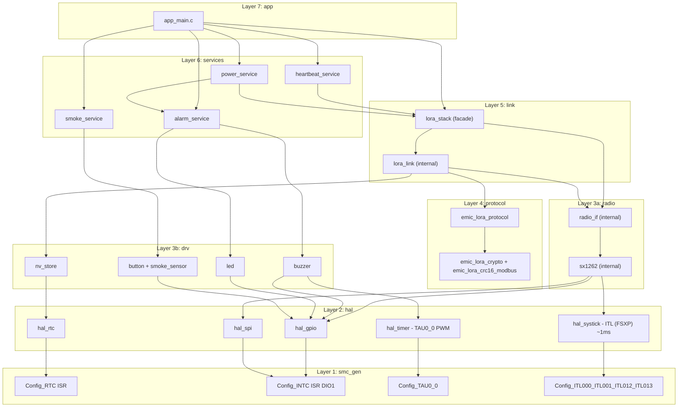
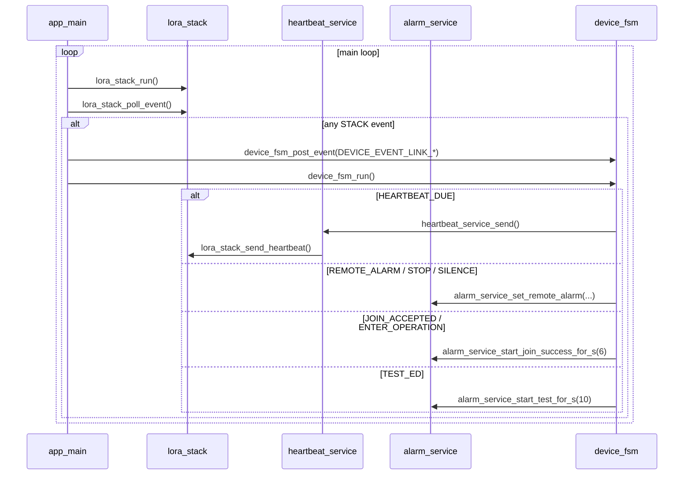
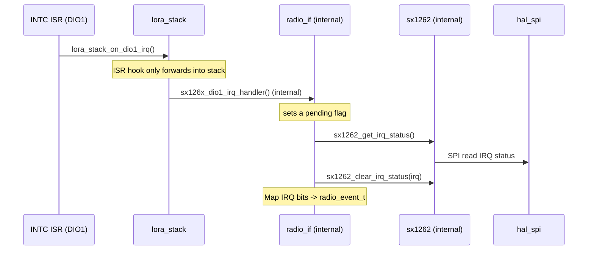
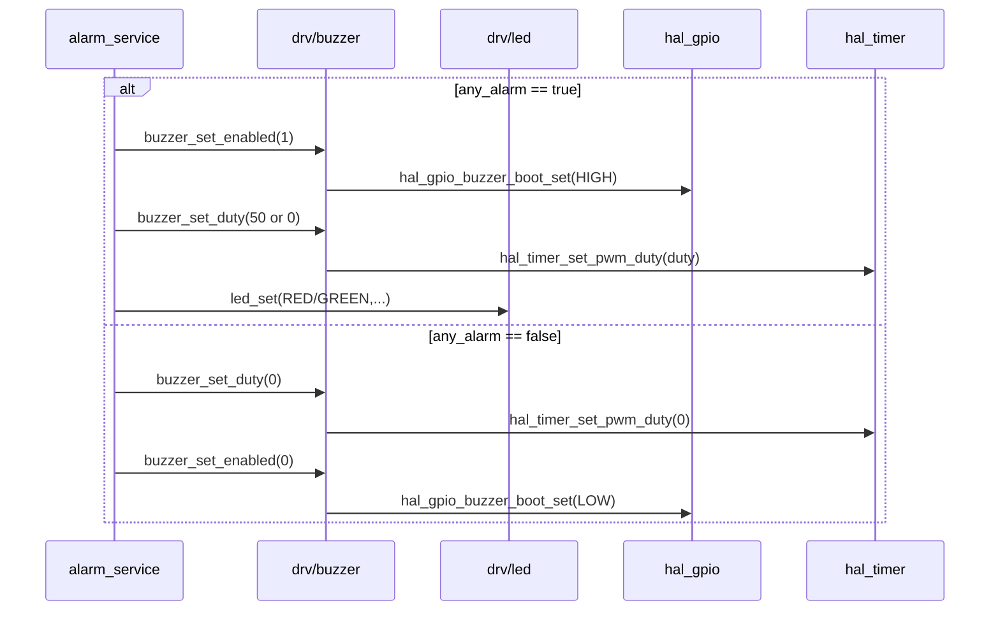
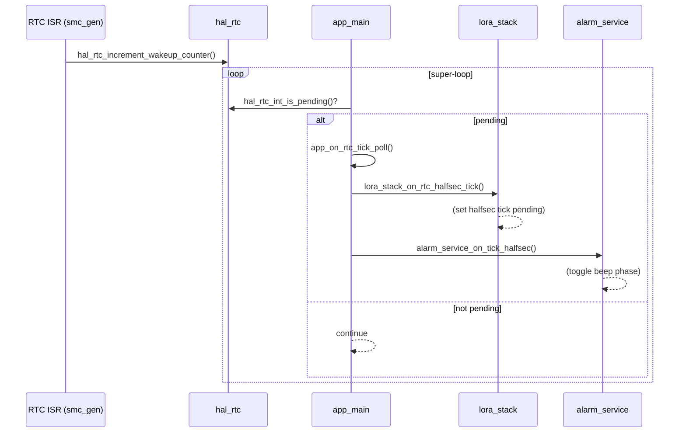
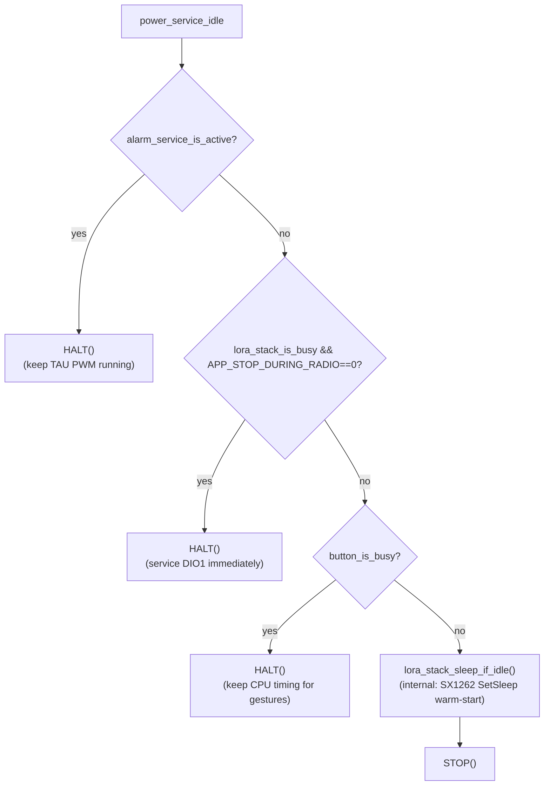

# Tổng quan luồng gọi giữa các layer (ai gọi ai)

Mục tiêu: cho cái nhìn **trực quan** về quan hệ phụ thuộc và các **điểm giao tiếp** quan trọng giữa các layer trong firmware hiện tại.

---

## 1) Layer map (phụ thuộc 1 chiều)

### 1.1 Sơ đồ phụ thuộc (Dependency diagram)



### 1.2 Dependency rules (tuân thủ 1 chiều)

| Layer    | Gọi                 | Được gọi bởi |
| -------- | -------------------- | ----------------- |
| app      | services, link       | main()            |
| services | link, drv, hal       | app               |
| link     | radio, protocol, drv | app, services     |
| protocol | hal/utils (crypto)   | link              |
| radio    | drv, hal             | link (internal)   |
| drv      | hal                  | services, radio   |
| hal      | smc_gen              | (all)             |
| smc_gen  | (hw registers)       | hal               |

Ghi chú:

- Luồng phụ thuộc "đúng hướng": `app → services → link → radio → drv → hal → smc_gen`.
- `protocol` là thư viện logic (build/parse frame + crypto) không chạm phần cứng.
- Không được gọi "ngược lên" (ví dụ `hal` không gọi `app`).

---

## 2) Các điểm giao tiếp quan trọng (cross-layer API)

### 2.1 App ↔ Services ↔ Link

- `app_main.c`:

  - Mỗi vòng lặp: `button_run()` → `lora_stack_run()` → `alarm_service_run()`.
  - Sau đó gom event từ button/link/smoke và **post vào `device_fsm`**.
  - `device_fsm_run()` mới là nơi ra quyết định: cập nhật alarm state và gọi các trigger `lora_stack_*` tương ứng.
- `heartbeat_service_send()` chỉ là wrapper: gọi `lora_stack_send_heartbeat()`.

Các trigger từ `device_fsm` xuống stack (app-facing):

- Local alarm ON: `lora_stack_notify_local_alarm()` (smoke detected / test-hold)
- Local alarm OFF: `lora_stack_notify_local_alarm_cleared()` (smoke cleared / test release)

Các event từ `lora_stack_poll_event()` (hiện tại):

- `HEARTBEAT_DUE`
- `REMOTE_ALARM`
- `REMOTE_ALARM_STOP`
- `REMOTE_SILENCE`
- `GW_LOST`
- `JOIN_ACCEPTED`
- `ENTER_OPERATION`
- `EXIT_GW`
- `TEST_ED`



### 2.2 Link ↔ Radio

Ghi chú: phần này là **internal detail** phía sau facade `lora_stack`.

- Link yêu cầu radio thực hiện:

  - `radio_request_cad()` (CAD paging)
  - `radio_request_rx()` (RX window sau CAD)
  - `radio_request_tx()` (uplink)
- Link tiêu thụ radio event:

  - `radio_poll_event()` trả về `CAD_DETECTED / CAD_DONE / RX_DONE / TX_DONE / TIMEOUT / ERROR`.

```mermaid
sequenceDiagram
  participant LINK as lora_link (internal)
  participant RADIO as radio_if (internal)

  Note over LINK: Periodic CAD schedule (every ~2s)
  LINK->>RADIO: radio_request_cad(APP_CAD_SYMBOLS)

  loop poll until event
    LINK->>RADIO: radio_poll_event()
    alt CAD_DETECTED
      RADIO-->>LINK: RADIO_EVENT_CAD_DETECTED
      LINK->>RADIO: radio_request_rx(APP_RX_AFTER_CAD_MS)
    else CAD_DONE
      RADIO-->>LINK: RADIO_EVENT_CAD_DONE
    else RX_DONE
      RADIO-->>LINK: RADIO_EVENT_RX_DONE
    else TX_DONE
      RADIO-->>LINK: RADIO_EVENT_TX_DONE
    else TIMEOUT or ERROR
      RADIO-->>LINK: RADIO_EVENT_TIMEOUT / RADIO_EVENT_ERROR
    end
  end
```

### 2.3 Radio ↔ SX1262 driver ↔ HAL

Ghi chú: phần này là **internal detail** phía sau facade `lora_stack`.

- `radio_if.c` giữ ISR "mỏng":

  - ISR DIO1 gọi `lora_stack_on_dio1_irq()`; bên trong stack sẽ gọi `sx126x_dio1_irq_handler()` (internal) để set cờ `s_irq_pending`.
  - Main loop gọi `radio_poll_event()` → đọc IRQ qua SPI (`sx1262_get_irq_status()`) và map sang `radio_event_t`.
- `sx1262.c` dùng:

  - `hal_spi_*` cho SPI.
  - `hal_gpio_*` cho BUSY/RESET/CS/ANT_SW.
  - `hal_systick_delay_ms()` cho delay reset/init.



### 2.4 Services ↔ Drivers ↔ HAL (buzzer/LED/button)

- `alarm_service` điều khiển:

  - `buzzer_set_enabled()` (nguồn/gate BUZZER_BOOT)
  - `buzzer_set_duty()` (PWM duty)
  - `led_set()` (LED)
- `buzzer.c` dùng:

  - `hal_timer_set_pwm_duty()` (TAU0_0 PWM) + `hal_gpio_buzzer_boot_set()`.



---

## 3) Biên ISR (interrupt boundary) — "ai đánh thức ai"

### 3.1 RTC interrupt → main tick



### 3.2 DIO1 interrupt (SX1262) → main xử lý IRQ qua SPI


---

## 4) Ghi chú về low-power



- `alarm_service_is_active()` được hiểu là **buzzer cần chạy pattern** (giữ clock/PWM). Một số status chỉ dùng LED (offline/low-batt) thì vẫn có thể STOP.
- `APP_STOP_DURING_RADIO` là compile-time flag:

  - `0` (mặc định): đang radio busy thì HALT.
  - `1`: cho phép STOP khi radio busy và **trông chờ DIO1** đánh thức MCU.
- SysTick ~1ms (ITL/FSXP) **không** là timebase chính; timebase chính vẫn là RTC tick 0.5s.
- Trong phiên bản hiện tại, systick được bật theo nhu cầu (chủ yếu khi xử lý gesture/button và buzzer pattern), và sẽ được tắt khi idle để tiết kiệm năng lượng.

Ghi chú cập nhật (encapsulation):

- `power_service` không gọi trực tiếp `radio_if`; thay vào đó dùng `lora_stack_is_busy()` và `lora_stack_sleep_if_idle()`.
