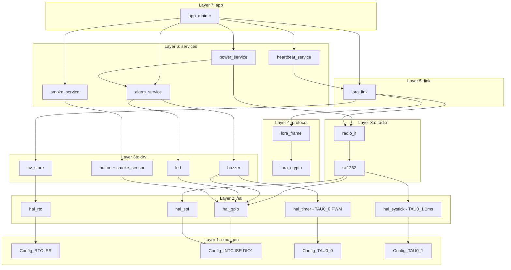
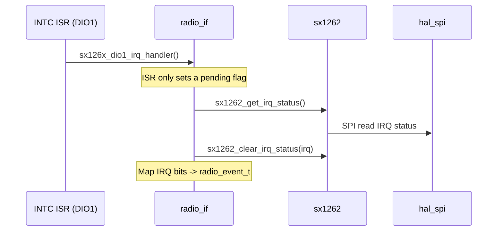
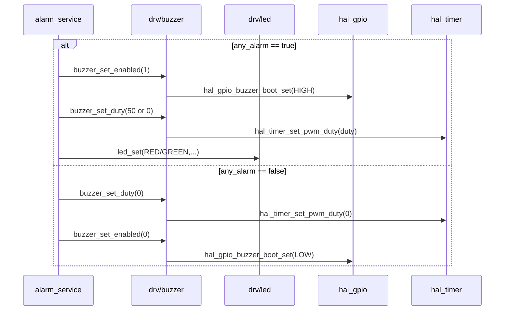
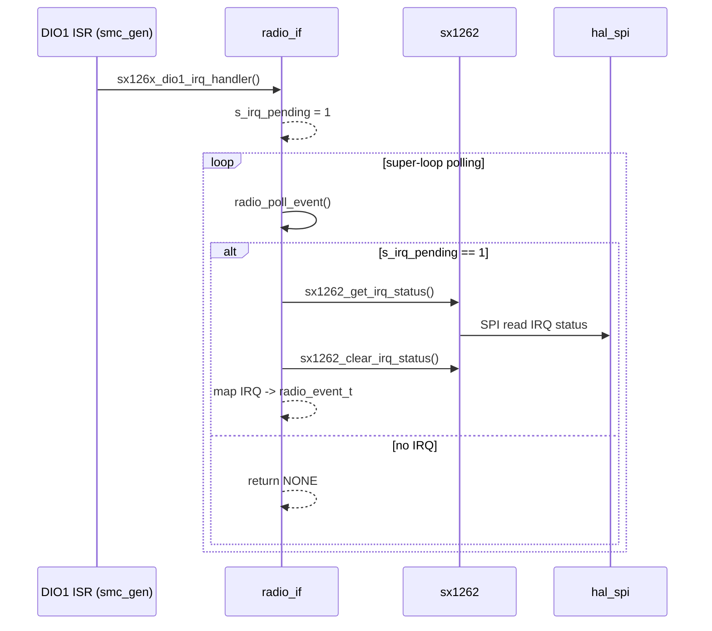
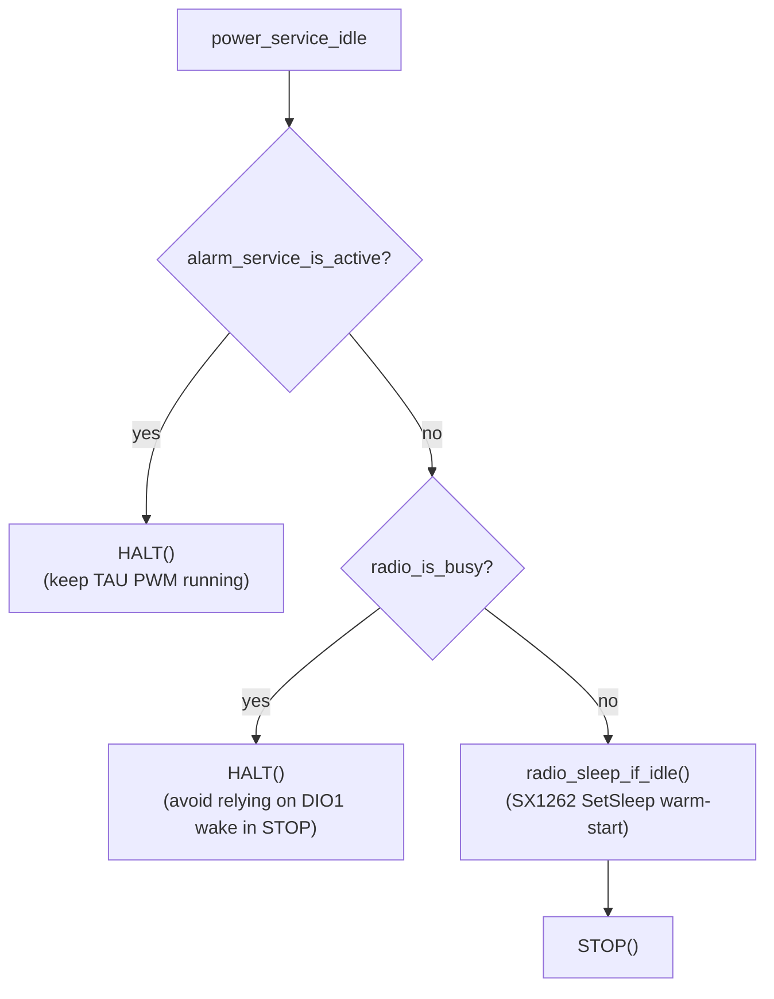

# Tổng quan luồng gọi giữa các layer (ai gọi ai)

Mục tiêu: cho cái nhìn **trực quan** về quan hệ phụ thuộc và các **điểm giao tiếp** quan trọng giữa các layer trong firmware hiện tại.

---

## 1) Layer map (phụ thuộc 1 chiều)

### 1.1 Sơ đồ phụ thuộc (Dependency diagram)



### 1.2 Dependency rules (tuân thủ 1 chiều)

| Layer    | Gọi                 | Được gọi bởi |
| -------- | -------------------- | ----------------- |
| app      | services, link       | main()            |
| services | link, drv, hal       | app               |
| link     | radio, protocol, drv | app, services     |
| protocol | hal/utils (crypto)   | link              |
| radio    | drv, hal             | services, link    |
| drv      | hal                  | services, radio   |
| hal      | smc_gen              | (all)             |
| smc_gen  | (hw registers)       | hal               |

Ghi chú:

- Luồng phụ thuộc "đúng hướng": `app → services → link → radio → drv → hal → smc_gen`.
- `protocol` là thư viện logic (build/parse frame + crypto) không chạm phần cứng.
- Không được gọi "ngược lên" (ví dụ `hal` không gọi `app`).

---

## 2) Các điểm giao tiếp quan trọng (cross-layer API)

### 2.1 App ↔ Services ↔ Link

- `app_main.c`:

  - Gọi `lora_link_run()` mỗi vòng lặp.
  - Gọi `lora_link_poll_event()` để lấy event (HEARTBEAT_DUE / REMOTE_ALARM).
  - Gọi `lora_link_notify_local_alarm()` khi smoke/local alarm.
- `heartbeat_service_send()` chỉ là wrapper: gọi `lora_link_send_heartbeat()`.

```mermaid
sequenceDiagram
  participant APP as app_main
  participant LINK as lora_link
  participant HB as heartbeat_service
  participant ALARM as alarm_service

  loop main loop
    APP->>LINK: lora_link_run()
    APP->>LINK: lora_link_poll_event()
    alt HEARTBEAT_DUE
      APP->>HB: heartbeat_service_send()
      HB->>LINK: lora_link_send_heartbeat()
    else REMOTE_ALARM
      APP->>ALARM: alarm_service_set_remote_alarm(1)
    end
  end
```

### 2.2 Link ↔ Radio

- Link yêu cầu radio thực hiện:

  - `radio_request_cad()` (CAD paging)
  - `radio_request_rx()` (RX window sau CAD)
  - `radio_request_tx()` (uplink)
- Link tiêu thụ radio event:

  - `radio_poll_event()` trả về `CAD_DETECTED / CAD_DONE / RX_DONE / TX_DONE / TIMEOUT / ERROR`.

```mermaid
sequenceDiagram
  participant LINK as lora_link
  participant RADIO as radio_if

  Note over LINK: Periodic CAD schedule (every ~2s)
  LINK->>RADIO: radio_request_cad(APP_CAD_SYMBOLS)

  loop poll until event
    LINK->>RADIO: radio_poll_event()
    alt CAD_DETECTED
      RADIO-->>LINK: RADIO_EVENT_CAD_DETECTED
      LINK->>RADIO: radio_request_rx(APP_RX_AFTER_CAD_MS)
    else CAD_DONE
      RADIO-->>LINK: RADIO_EVENT_CAD_DONE
    else RX_DONE
      RADIO-->>LINK: RADIO_EVENT_RX_DONE
    else TX_DONE
      RADIO-->>LINK: RADIO_EVENT_TX_DONE
    else TIMEOUT or ERROR
      RADIO-->>LINK: RADIO_EVENT_TIMEOUT / RADIO_EVENT_ERROR
    end
  end
```

### 2.3 Radio ↔ SX1262 driver ↔ HAL

- `radio_if.c` giữ ISR "mỏng":

  - ISR DIO1 gọi `sx126x_dio1_irq_handler()` chỉ set cờ `s_irq_pending`.
  - Main loop gọi `radio_poll_event()` → đọc IRQ qua SPI (`sx1262_get_irq_status()`) và map sang `radio_event_t`.
- `sx1262.c` dùng:

  - `hal_spi_*` cho SPI.
  - `hal_gpio_*` cho BUSY/RESET/CS/ANT_SW.
  - `hal_systick_delay_ms()` cho delay reset/init.



### 2.4 Services ↔ Drivers ↔ HAL (buzzer/LED/button)

- `alarm_service` điều khiển:

  - `buzzer_set_enabled()` (nguồn/gate BUZZER_BOOT)
  - `buzzer_set_duty()` (PWM duty)
  - `led_set()` (LED)
- `buzzer.c` dùng:

  - `hal_timer_set_pwm_duty()` (TAU0_0 PWM) + `hal_gpio_buzzer_boot_set()`.



---

## 3) Biên ISR (interrupt boundary) — "ai đánh thức ai"

### 3.1 RTC interrupt → main tick

```mermaid
sequenceDiagram
  participant ISR as RTC ISR (smc_gen)
  participant HAL as hal_rtc
  participant APP as app_main
  participant LINK as lora_link
  participant ALARM as alarm_service

  ISR->>HAL: hal_rtc_increment_wakeup_counter()

  loop super-loop
    APP->>HAL: hal_rtc_int_is_pending()?
    alt pending
      APP->>APP: app_on_rtc_tick_poll()
      APP->>LINK: lora_link_on_rtc_halfsec_tick()
      LINK-->>LINK: (set halfsec tick pending)
      APP->>ALARM: alarm_service_on_tick_halfsec()
      ALARM-->>ALARM: (toggle beep phase)
    else not pending
      APP-->>APP: continue
    end
  end
```

### 3.2 DIO1 interrupt (SX1262) → main xử lý IRQ qua SPI



---

## 4) Ghi chú về low-power



- SysTick 1ms (TAU0_1) **không** là timebase chính; chỉ nên bật "khi cần". Hiện tại được dùng cho delay init SX1262 và đã được dừng lại sau init.
