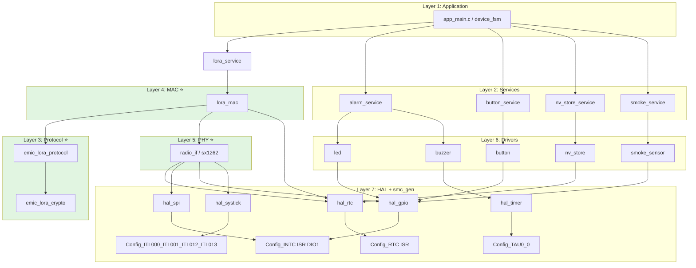
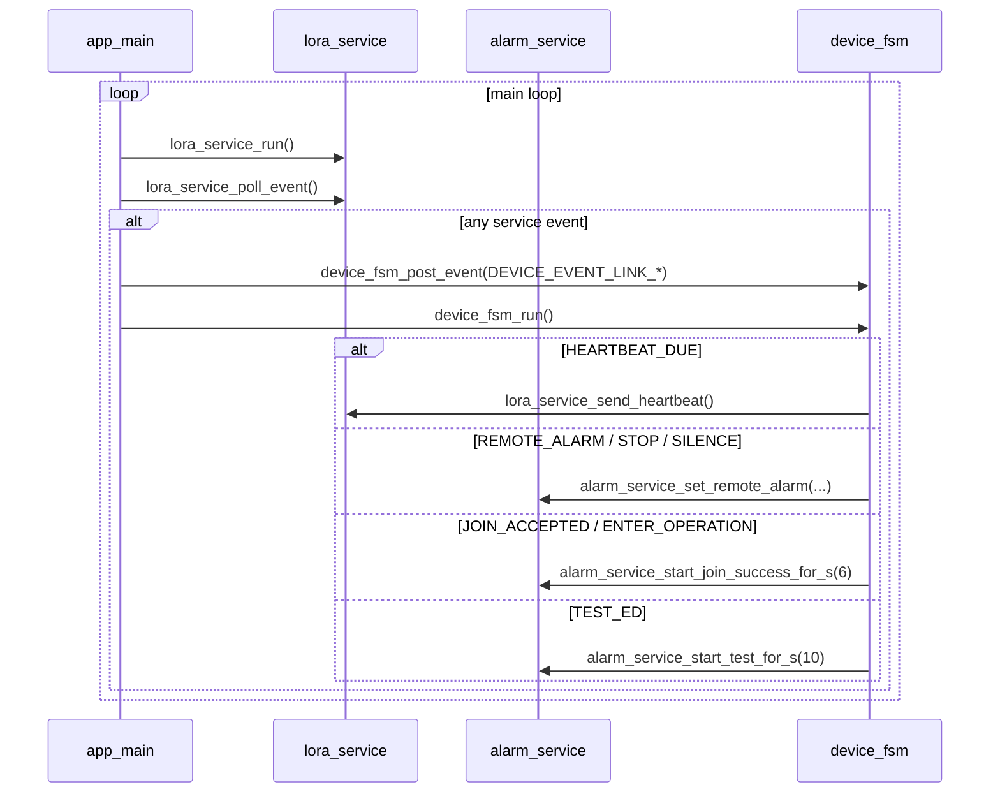
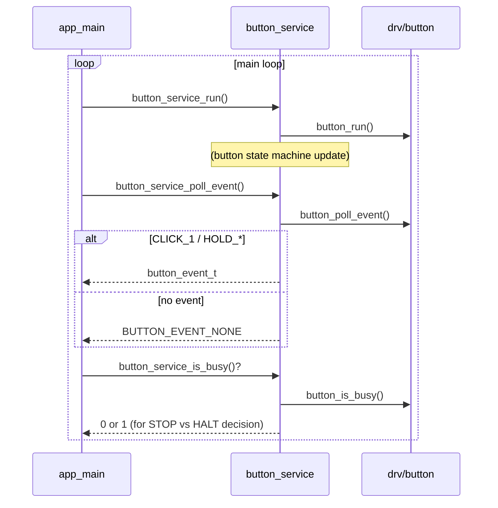
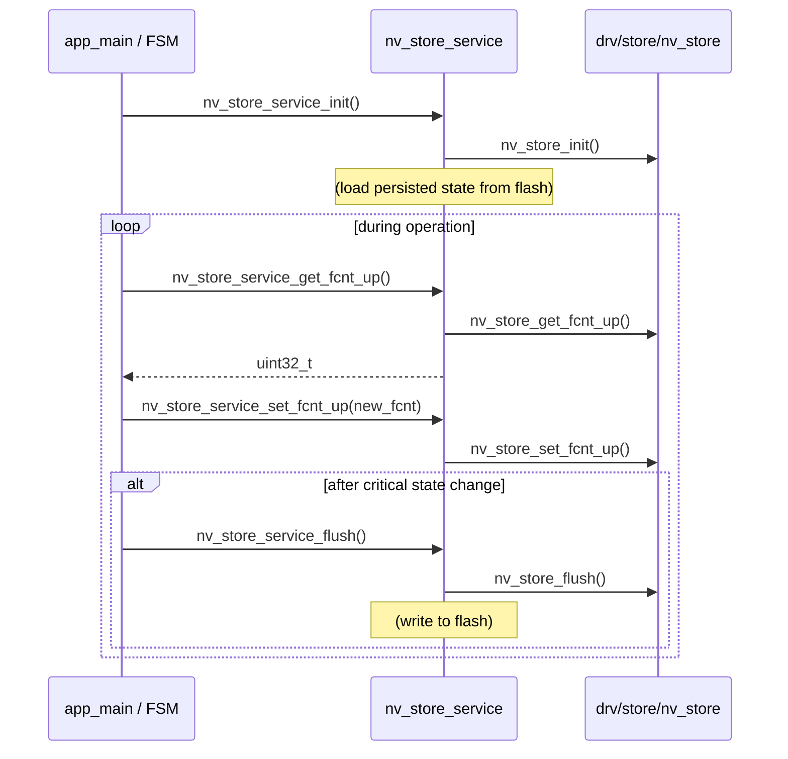
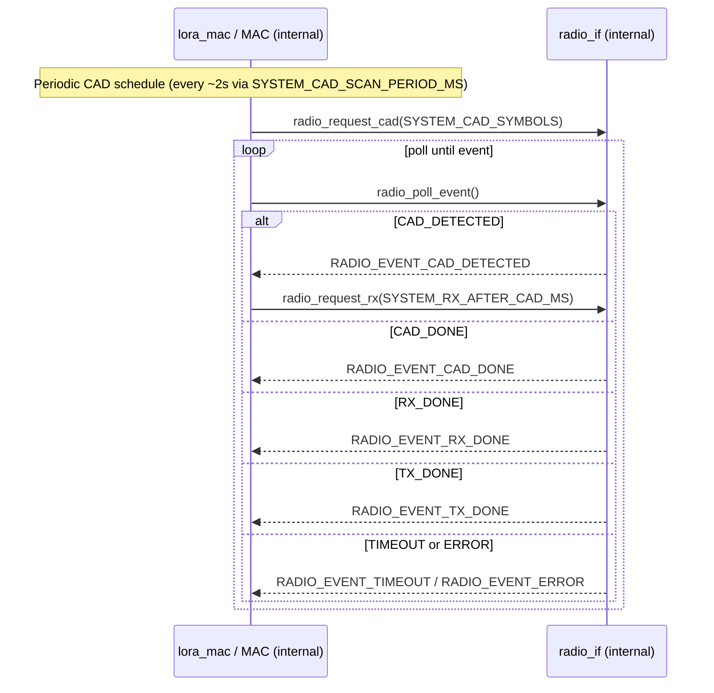
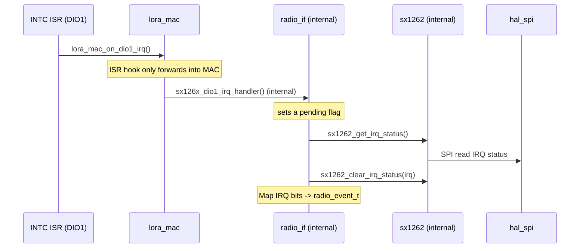
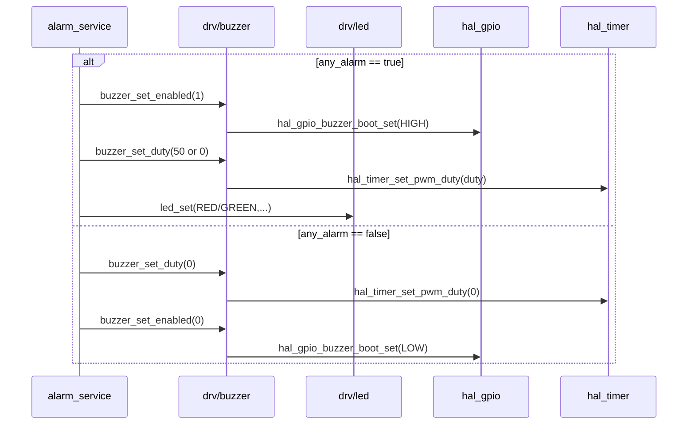
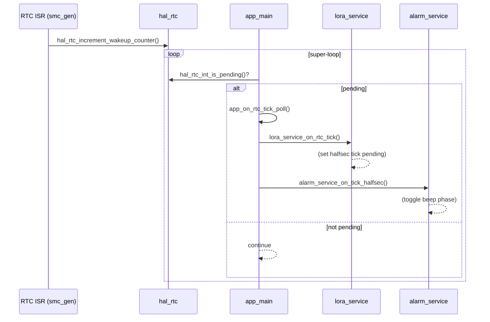
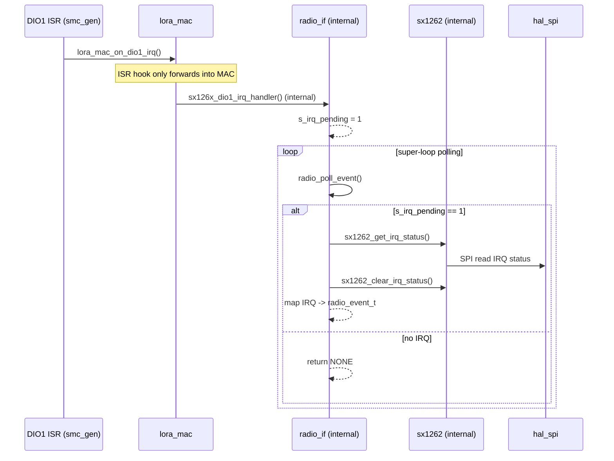

# Tổng quan luồng gọi giữa các layer (ai gọi ai)

Mục tiêu: cho cái nhìn **trực quan** về quan hệ phụ thuộc và các **điểm giao tiếp** quan trọng giữa các layer trong firmware hiện tại.

> **Tham chiếu tài liệu chuẩn:**
>
> - Kiến trúc layer: xem [emic_lora_stack_architecture.md](emic_lora_stack_architecture.md) (Mục 2-4: Protocol/MAC/PHY layers)
> - Định dạng frame & bảo mật: xem [emic_lora_protocol_frame_spec.md](emic_lora_protocol_frame_spec.md) (Mục 4-10: 11B header, AES-128-CCM, anti-replay, 19 message types)
> - **Terminology:** "MAC Layer" (không "Link Layer"), **"AES-128-CCM"** (Protocol layer encryption), **"msg_id"** (Protocol anti-replay counter, window=1)

---

## 1) Layer map (phụ thuộc 1 chiều)

### 1.1 Sơ đồ phụ thuộc (Dependency diagram)

**Cách đọc sơ đồ:** thể hiện **code dependency** (ai `#include` và gọi ai), KHÔNG phải data flow.

**Chú thích:** 

- **⭐** = 3 tầng core của EMIC LoRa Stack (Protocol/MAC/PHY)
- Sơ đồ thể hiện **code dependency** (compile-time `#include` và function call)
- **lora_service → MAC**: lora_service gọi lora_mac API
- **MAC → Protocol**: MAC gọi emic_lora_protocol_build/parse để encrypt/decrypt
- **MAC → PHY**: MAC gọi radio_if API
- **Data flow** (TX/RX runtime) khác với dependency - xem mục 1.3

---

### 1.2 Layer mapping table

| Layer                       | Module chính                                                                                           | Trách nhiệm                                | Gọi xuống (code dependency) |
| --------------------------- | ------------------------------------------------------------------------------------------------------- | -------------------------------------------- | ------------------ |
| **L1: Application**   | `app_main.c`, `device_fsm`                                                                          | Main loop, state machine                     | L2, L2a           |
| **L2a: lora_service** | `lora_service`                                                                                        | Stack entrypoint (TX/RX orchestration)       | **L4** (MAC)      |
| **L2: Services**      | `power_service`, `alarm_service`, `button_service`, `nv_store_service`, `smoke_service` | Business logic, driver facade                | L6                 |
| **L3: Protocol** ⭐   | `emic_lora_protocol`, `emic_lora_crypto`, `nonce_builder`                                         | AES-128-CCM, anti-replay, message types      | utils (crypto)     |
| **L4: MAC** ⭐        | `lora_mac`                                                                                            | Frame build/parse, ACK/Retry, channel access | **L3, L5**        |
| **L5: PHY** ⭐        | `radio_if`, `sx1262`                                                                                | LoRa modulation, RF config, RX/TX timing     | L7 (HAL)           |
| **L6: Drivers**       | `nv_store`, `smoke_sensor`, `button`, `led`, `buzzer`                                         | Peripheral drivers                           | L7                 |
| **L7: HAL + smc_gen** | `hal_rtc`, `hal_spi`, `hal_gpio`, `hal_timer`, `hal_systick`, `Config_*`                    | Hardware abstraction + ISR config            | Hardware registers |

**⭐ = EMIC LoRa Stack** (3 tầng core: Protocol/MAC/PHY)

**Chú ý:** 
- Cột "Gọi xuống" thể hiện **code dependency** (ai include và gọi ai)
- **MAC gọi Protocol** để build/parse frame (không phải Protocol gọi MAC)
- **Data flow** (TX/RX) khác với code dependency - xem mục 1.3 bên dưới

---

### 1.3 Dependency rules (actual code dependencies - ai include/gọi ai)

| Module/Layer       | Include/Gọi xuống | Được gọi bởi (từ trên xuống) |
| ------------------ | ------------------- | ----------------- |
| app                | services            | main()            |
| lora_service       | **MAC**           | app               |
| services (khác)    | drv                 | app               |
| **MAC**      | **protocol**, PHY   | lora_service      |
| **protocol** | utils (crypto)      | MAC               |
| **PHY**      | hal                 | MAC               |
| drv                | hal                 | services          |
| hal                | smc_gen             | PHY, drv          |
| smc_gen            | (hw registers)      | hal               |

**⚠️ Lưu ý quan trọng: Phân biệt giữa Code Dependency và Data Flow:**

- **Code dependency (dependency direction):** Ai `#include` và **gọi** ai
  - **lora_service → MAC → Protocol** (MAC gọi protocol để build/parse frame)
  - **MAC → PHY** (MAC gọi radio API)
  
- **Data flow (theo [emic_lora_stack_architecture.md](emic_lora_stack_architecture.md) Mục 4):**
  - **TX path (uplink):** Application → **Protocol** (encrypt) → **MAC** (frame) → **PHY** (RF bits) → Air
  - **RX path (downlink):** Air → **PHY** → **MAC** (parse) → **Protocol** (decrypt) → Application
  

**Implementation notes:**
- MAC layer owns the frame structure và gọi Protocol layer API (`emic_lora_protocol_build()`, `emic_lora_protocol_parse()`) để encrypt/decrypt payload
- Data flow đi từ Application xuống PHY (TX) và từ PHY lên Application (RX), nhưng **code dependency** là MAC gọi Protocol, không phải ngược lại
- **EMIC LoRa Stack 3 lớp chính** (theo [emic_lora_stack_architecture.md](emic_lora_stack_architecture.md)):
  - **Protocol layer:** Message types + payload semantics; AES-128-CCM (nonce/AAD/MIC); anti-replay `msg_id` (window=1, strictly monotonic)
  - **MAC layer:** Frame build/parse + addressing; ACK/Retry; channel access (CAD/CSMA)
  - **PHY layer:** LoRa modulation + RF config; RX/TX timing; CRC
- **Frame format** (theo [emic_lora_protocol_frame_spec.md](emic_lora_protocol_frame_spec.md) Section 4):
  - **11-byte header** (AAD) + 0-49 byte payload (encrypted) + 4-byte MIC
  - Header plaintext (không mã hóa), payload được AES-128-CCM encrypt bởi Protocol layer
- **Firmware modules** (không phải stack layers):
  - `app`, `services`, `drv`, `hal`, `smc_gen` là firmware organization
  - PHY layer được implement qua `radio_if` + `sx1262` driver (internal)
- **Configuration separation**: `system_config.h` (RF/MAC/protocol constants) vs `app_config.h` (application constants). Lower layers **KHÔNG** include `app_config.h`.
- Không được gọi "ngược lên" (ví dụ `hal` không gọi `app`).

---

## 2) Các điểm giao tiếp quan trọng (cross-layer API)

### 2.1 App ↔ Services ↔ MAC (Stack entrypoint)

**Module lora_service** là facade service bọc lấy **EMIC LoRa Stack** (MAC + PHY), cung cấp API sạch cho app và các service khác. 

**⚠️ Code dependency thực tế:**
- `lora_service` gọi **MAC layer** (`lora_mac`), không trực tiếp gọi Protocol
- **MAC layer** sở hữu frame structure và gọi **Protocol layer** API (`emic_lora_protocol_build()`, `emic_lora_protocol_parse()`) khi cần encrypt/decrypt
- Điều này đảm bảo MAC có toàn quyền kiểm soát frame format và timing, trong khi Protocol chỉ lo crypto + message semantics

- `app_main.c`:

  - Mỗi vòng lặp: `button_service_run()` → `lora_service_run()` → `alarm_service_run()`.
  - Sau đó gom event từ button_service/lora_service/smoke và **post vào `device_fsm`**.
  - `device_fsm_run()` mới là nơi ra quyết định: cập nhật alarm state và gọi các trigger `lora_service_*()` tương ứng.

Các trigger từ `device_fsm` xuống lora_service:

- Heartbeat: `lora_service_send_heartbeat()` (periodic keepalive to gateway)
- Local alarm ON: `lora_service_notify_alarm()` (smoke detected / test-hold)
- Local alarm OFF: `lora_service_notify_alarm_cleared()` (smoke cleared / test release)

Các event từ `lora_service_poll_event()` (xem [emic_lora_protocol_frame_spec.md](emic_lora_protocol_frame_spec.md) Section 9 cho đầy đủ 19 message types):

**Network events:**

- `HEARTBEAT_DUE`
- `JOIN_ACCEPTED` (Type 0x02: JOIN_ACCEPT)
- `ENTER_OPERATION` (Type 0x06: SET_OPERATIONAL)
- `LEAVE_NETWORK` (Type 0x0B: LEAVE_NETWORK)
- `GW_LOST`

**Alarm events (from GW):**

- `REMOTE_ALARM` (Type 0x03: ALARM)
- `REMOTE_ALARM_CLEAR` (Type 0x04: ALARM_CLEAR)
- `REMOTE_SILENCE` (Type 0x05: SIREN_SILENCE)

**Configuration/test events:**

- `CFG_SET` (Type 0x07: CFG_SET)
- `CFG_GET` (Type 0x08: CFG_GET)
- `TEST_ED` (Type 0x09: TEST_ED)
- `TIME_SYNC` (Type 0x0A: TIME_SYNC)

**Note:** Frame spec định nghĩa 19 types; các types khác (JOIN_REQUEST, HEARTBEAT, FAULT, GW_*, BEACON_*) được xử lý internal bởi MAC/Protocol layers.

### 2.1.1 Button Service (Firmware module)

**Module button_service** là facade service bọc lấy drv/button driver, cung cấp API sạch cho app.

- `app_main.c`:

  - `button_service_run()`: cập nhật button state machine, debounce, gesture detection.
  - `button_service_poll_event()`: poll event từ queue (CLICK_1/2/3/4, HOLD_1S/3S/5S).
  - `button_service_is_pressed()`: check nút smoke-test hiện tại có nhấn không.
  - `button_service_is_busy()`: check nếu đang xử lý gesture → system cần HALT (không STOP) để giữ 1ms tick.

### 2.1.2 NV Store Service (Firmware module)

**Module nv_store_service** là facade service bọc lấy drv/store/nv_store driver, cung cấp API sạch cho app.

- `app_main.c`:

  - `nv_store_service_init()`: Load persisted state từ flash/EEPROM.
  - `nv_store_service_get_*()` / `nv_store_service_set_*()`: Access frame counters, device identity, config parameters.
  - `nv_store_service_factory_reset()`: Clear all persisted state (user-triggered).
  - `nv_store_service_flush()`: Ensure changes persisted to NVM.

### 2.2 MAC ↔ Protocol

**⚠️ Code dependency:** **MAC layer gọi Protocol layer**, không phải ngược lại.

- **TX (uplink):** MAC nhận request từ app/service → gọi `emic_lora_protocol_build()` để encrypt payload → đóng gói frame → send qua PHY
- **RX (downlink):** MAC nhận frame từ PHY → parse header → gọi `emic_lora_protocol_parse()` để verify MIC + decrypt payload → forward event lên app

**Protocol layer API (được MAC gọi):**

- `emic_lora_protocol_build()` - MAC gọi để encrypt payload và build frame
- `emic_lora_protocol_parse()` - MAC gọi để parse và decrypt received frame

**Data flow perspective** (theo [emic_lora_stack_architecture.md](emic_lora_stack_architecture.md)):
- TX: Application data → Protocol (encrypt) → MAC (frame) → PHY → RF
- RX: RF → PHY → MAC (parse) → Protocol (decrypt) → Application

Nhưng **implementation**: MAC owns frame structure và orchestrates toàn bộ quá trình, gọi Protocol khi cần crypto operations.

---

### 2.3 MAC ↔ PHY (Radio)

Ghi chú: phần này là **internal detail** của MAC layer.

- MAC yêu cầu PHY (radio) thực hiện:

  - `radio_request_cad()` (CAD paging)
  - `radio_request_rx()` (RX window sau CAD)
  - `radio_request_tx()` (uplink)
- MAC tiêu thụ radio event:

  - `radio_poll_event()` trả về `CAD_DETECTED / CAD_DONE / RX_DONE / TX_DONE / TIMEOUT / ERROR`.

### 2.4 PHY (Radio) ↔ SX1262 driver ↔ HAL

Ghi chú: phần này là **internal detail** của PHY layer.

- `radio_if.c` giữ ISR "mỏng":

  - ISR DIO1 gọi `lora_mac_on_dio1_irq()`; bên trong MAC sẽ gọi `sx126x_dio1_irq_handler()` (internal) để set cờ `s_irq_pending`.
  - Main loop gọi `radio_poll_event()` → đọc IRQ qua SPI (`sx1262_get_irq_status()`) và map sang `radio_event_t`.
- `sx1262.c` dùng:

  - `hal_spi_*` cho SPI.
  - `hal_gpio_*` cho BUSY/RESET/CS/ANT_SW.
  - `hal_systick_delay_ms()` cho delay reset/init.

### 2.4 Services ↔ Drivers ↔ HAL (buzzer/LED/button)

- `alarm_service` điều khiển:

  - `buzzer_set_enabled()` (nguồn/gate BUZZER_BOOT)
  - `buzzer_set_duty()` (PWM duty)
  - `led_set()` (LED)
- `buzzer.c` dùng:

  - `hal_timer_set_pwm_duty()` (TAU0_0 PWM) + `hal_gpio_buzzer_boot_set()`.

---

## 3) Biên ISR (interrupt boundary) — "ai đánh thức ai"

### 3.1 RTC interrupt → main tick

### 3.2 DIO1 interrupt (SX1262) → main xử lý IRQ qua SPI

---

## 4) Ghi chú về low-power

- `alarm_service_is_active()` được hiểu là **buzzer cần chạy pattern** (giữ clock/PWM). Một số status chỉ dùng LED (offline/low-batt) thì vẫn có thể STOP.
- `APP_STOP_DURING_RADIO` là compile-time flag:

  - `0` (mặc định): đang radio busy thì HALT.
  - `1`: cho phép STOP khi radio busy và **trông chờ DIO1** đánh thức MCU.
- SysTick ~1ms (ITL/FSXP) **không** là timebase chính; timebase chính vẫn là RTC tick 0.5s.
- Trong phiên bản hiện tại, systick được bật theo nhu cầu (chủ yếu khi xử lý gesture/button và buzzer pattern), và sẽ được tắt khi idle để tiết kiệm năng lượng.

Ghi chú cập nhật:

- `power_service` không gọi trực tiếp `radio_if` hay `lora_mac`; thay vào đó dùng `lora_service_is_busy()` và `lora_service_sleep()` để duy trì strict layer separation.
- CAD scan period và RX/TX windows được định cấu hình qua `system_config.h` (SYSTEM_CAD_SCAN_PERIOD_MS, SYSTEM_RX_AFTER_CAD_MS, SYSTEM_RX_AFTER_TX_MS) chứ không phải `app_config.h`.
- Xem [emic_lora_stack_architecture.md](emic_lora_stack_architecture.md) Mục 3 cho trách nhiệm của Protocol/MAC/PHY layers.
