# Luồng hoạt động chính (runtime flow)

Mục tiêu: mô tả **1 cách trực quan nhất** "hệ thống chạy như thế nào" từ lúc boot đến các nhánh: bình thường, local alarm, remote alarm.

> **Tham chiếu tài liệu chuẩn:**
> - Kiến trúc layer: xem [emic_lora_stack_architecture.md](emic_lora_stack_architecture.md) (Mục 3-4: MAC Layer & Protocol Layer)
> - Định dạng frame & bảo mật: xem [emic_lora_protocol_frame_spec.md](emic_lora_protocol_frame_spec.md) (Mục 8: AES-128-CCM, anti-replay)
> - Terminology: "MAC Layer" (chứ không "Link Layer"), "msg_id" (Protocol counter), "MAC seq" (link-level sequence)

---

## 0) Tham số cấu hình chính (tóm tắt)

- Timebase hệ thống: **RTC tick 0.5s**
- CAD scan period: theo `APP_CAD_SCAN_PERIOD_MS` (hiện tại chọn **5.0s**)
- CAD symbols: 4
- RX after CAD hit: ~120 ms
- Heartbeat uplink: ~240 s ± jitter
- Gateway → Node: cung cấp **time_rtc (seconds)** trong **Extend** của `JOIN_ACCEPT` và `ACK` (theo [emic_lora_protocol_frame_spec.md](emic_lora_protocol_frame_spec.md))
- Node gateway-lost: **> 300s** không thấy **downlink hợp lệ** (sau khi đã từng thấy downlink)
- **Bảo mật:** Toàn bộ payload được mã hóa và xác thực bằng **AES-128-CCM** (xem [emic_lora_stack_architecture.md](emic_lora_stack_architecture.md) Mục 4.2)
- **Anti-replay:** Protocol layer kiểm tra **msg_id (24-bit) strictly monotonic** per source với window=1 (xem [emic_lora_stack_architecture.md](emic_lora_stack_architecture.md) Mục 4.3)

---

## 1) Boot flow

Ghi chú (đồng bộ với firmware hiện tại):

- `joined` **không** được lưu bằng cờ riêng trong DataFlash.
- Node suy ra trạng thái `joined` bằng cách đọc **PanID/NetID (6 bytes)** trong DataFlash:
  - all-zero ⇒ chưa joined (dùng `APP_PAN_ID` làm pairing/default)
  - khác all-zero ⇒ đã joined (dùng PanID đã lưu)

**Dữ liệu lưu trong DataFlash (`nv_store`, record v6):**

- `fcnt_up` (checkpoint theo mask để giảm wear)
- `fcnt_down` (next expected, cập nhật từ downlink payload có FCnt)
- `last_alarm_id`
- `lora_channel_idx`
- `pan_id` (NetID/PanID, 6 bytes)
- `seri_ed` (6 bytes)
- `fire_start_epoch_s` (epoch seconds từ 2000-01-01; 0 = unknown)
- Device config:
  - `lora_rssi_threshold_dbm` (int16 dBm)
  - `heartbeat_period_s` (uint16 seconds)
  - `smoke_sensitivity` (uint16)
  - `heat_sensitivity` (uint16)

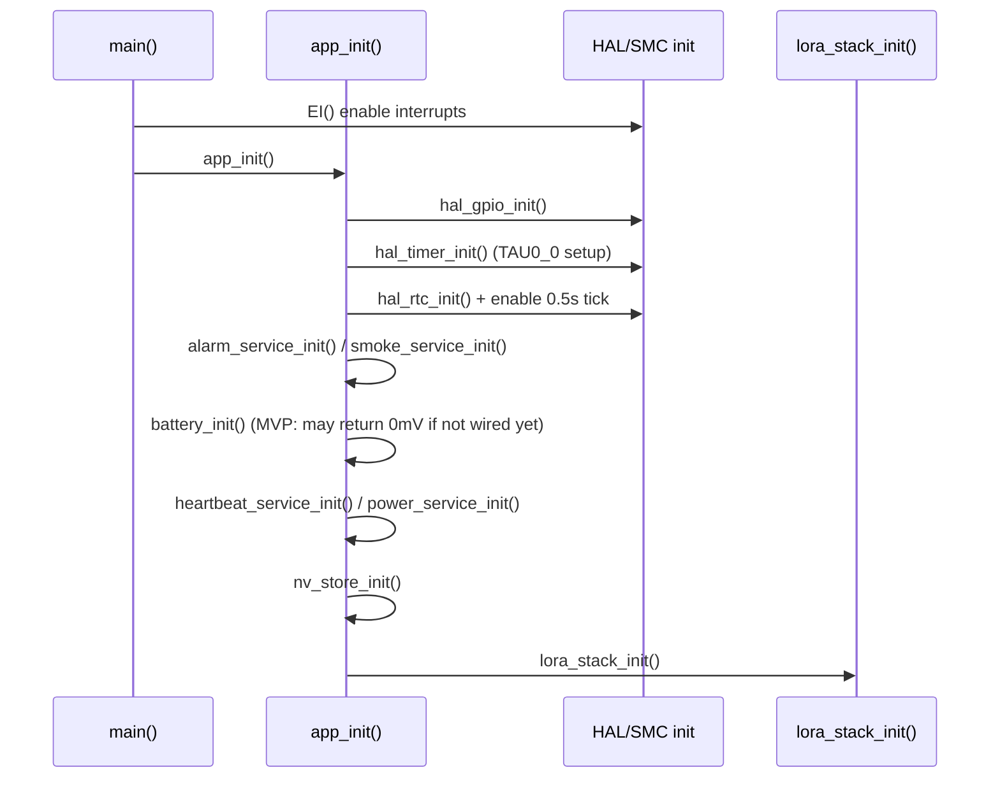

---

## 2) Main loop (super-loop) — khung chạy chung

Vòng lặp nằm trong `app_run_forever()`:

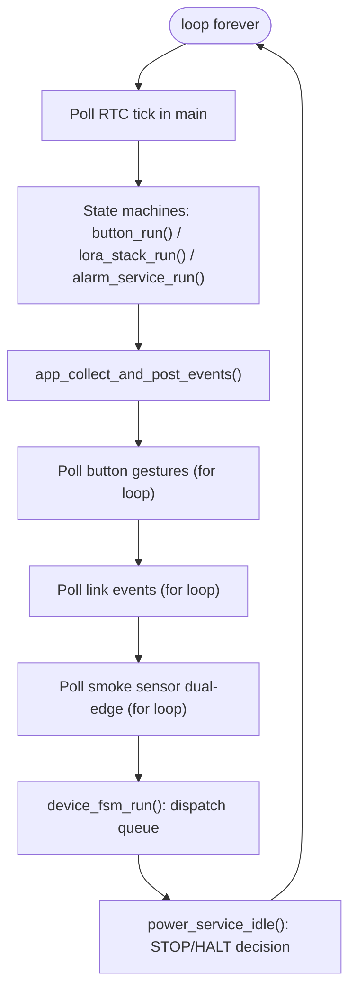

**Luồng chi tiết:**

1. **Poll RTC tick** (`app_on_rtc_tick_poll()`): kiểm tra RTCIF flag.
2. **Run state machines**: update internal FSM states (không emit event ra ngoài):
   - `button_run()`: gesture recognition FSM (IDLE/PRESSED/WAIT_SECOND)
   - `lora_stack_run()`: (MAC layer) CAD/RX/TX FSM (IDLE/WAIT_CAD/WAIT_RX/WAIT_TX) — xem [emic_lora_stack_architecture.md](emic_lora_stack_architecture.md) Mục 3
   - `alarm_service_run()`: buzzer pattern FSM
3. **Collect and post all events** (`app_collect_and_post_events()`):
  - Button gestures: loop poll → CLICK_1..CLICK_4, HOLD_1S/3S/5S
    - `app_main` maps these raw gestures into **semantic** `DEVICE_EVENT_BTN_*` actions.
  - MAC layer events: loop poll → HEARTBEAT_DUE/REMOTE_ALARM_ON/REMOTE_ALARM_OFF/REMOTE_SILENCE + protocol events (xem [emic_lora_stack_architecture.md](emic_lora_stack_architecture.md) Mục 3: MAC Layer)
   - Smoke sensor: loop poll → FIRE_DETECTED/FIRE_CLEARED (dual-edge detection)
4. **Dispatch FSM** (`device_fsm_run()`): drain event queue → state-dependent actions
5. **Power idle** (`power_service_idle()`): decide STOP vs HALT based on activity state

**Ghi chú về event collection pattern:**

- Mỗi event source dùng `for(;;)` loop poll cho đến khi nhận `NONE` event → break
- Tất cả events được post vào device_fsm ring buffer queue (capacity 8 slots)
- Nếu queue full → event dropped (logged nhưng không critical)

**Timebase hệ thống:**

- **RTC constant-period 0.5s** là tick chính của hệ thống (không phải 1ms SysTick)
- Button timing dùng `hal_systick_get_ms()` (ITL/FSXP), chỉ bật khi cần debounce/hold/double-click
- Hệ thống tắt systick khi idle để tiết kiệm năng lượng

---

## 2.1) Application state machine (device_fsm)

Trạng thái chính ở lớp Application hiện tại được quản lý bởi `device_fsm` (business state, không phải power state).

**States:**

- `DEVICE_STATE_NORMAL`: không có alarm
- `DEVICE_STATE_ALARM`: đang alarm (có thể do local smoke/button hoặc remote GW)

**Events có thể làm đổi state (state-transition events):**

- `DEVICE_EVENT_SMOKE_DETECTED`: set local alarm ON
- `DEVICE_EVENT_SMOKE_CLEARED`: set local alarm OFF (Option B: auto-clear)
- `DEVICE_EVENT_LINK_REMOTE_ALARM_ON`: set remote alarm ON
- `DEVICE_EVENT_LINK_REMOTE_ALARM_OFF`: set remote alarm OFF
- `DEVICE_EVENT_BTN_TEST`: (SMOKE_TEST) cũng set local alarm ON

**Ghi chú:**

- Mặc dù chỉ có 1 state `DEVICE_STATE_ALARM`, firmware vẫn track **2 nguồn alarm** nội bộ: `local_alarm` và `remote_alarm`.
- Điều này giúp xử lý đúng policy (ví dụ: remote alarm chỉ clear khi nhận ALARM_STOP/SILENCE từ GW; local alarm có thể auto-clear theo smoke sensor).

### 2.1.1) Cách nhìn dễ hơn (recommended): state = OR(local_alarm, remote_alarm)

Thay vì vẽ nhiều self-loop (khó đọc), hãy nhìn theo **2 cờ (flags)**:

- `local_alarm`: set/clear bởi smoke sensor (DETECTED/CLEARED) và SMOKE_TEST
- `remote_alarm`: set/clear bởi GW (REMOTE_ALARM_ON / REMOTE_ALARM_OFF)

Rule state:

- `DEVICE_STATE_ALARM` khi `(local_alarm != 0) || (remote_alarm != 0)`
- `DEVICE_STATE_JOIN_MODE` khi `(local_alarm == 0) && (remote_alarm == 0) && (join_mode_active != 0)`
- `DEVICE_STATE_NORMAL` khi `(local_alarm == 0) && (remote_alarm == 0) && (join_mode_active == 0)`

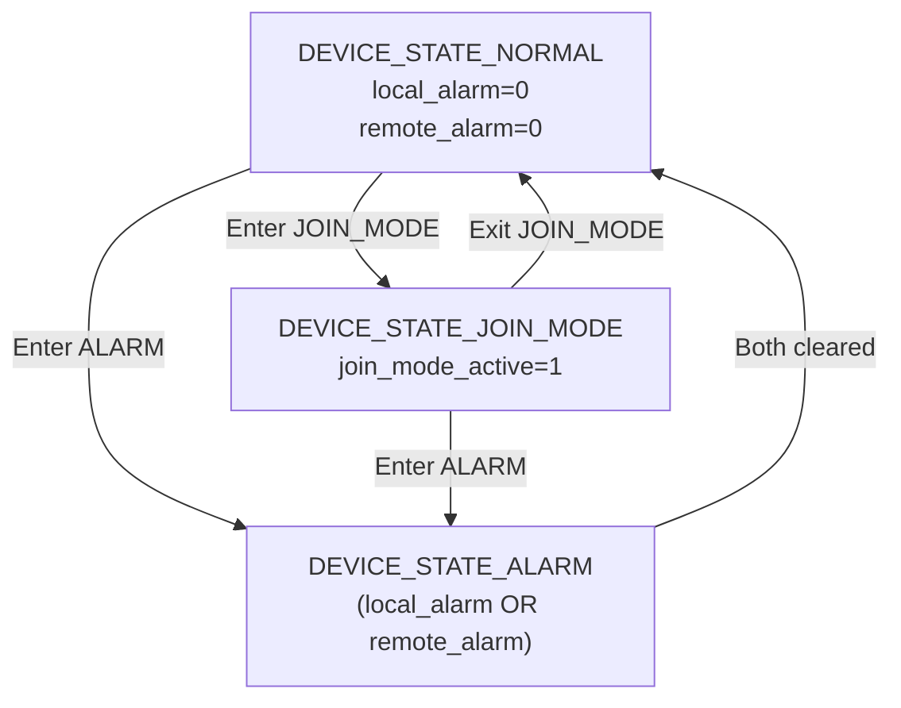

**Events that ENTER ALARM** (NORMAL → ALARM):
- `DEVICE_EVENT_SMOKE_DETECTED`: set `local_alarm=1`, notify GW
- `DEVICE_EVENT_BTN_TEST`: set `local_alarm=1`, notify GW
- `DEVICE_EVENT_LINK_REMOTE_ALARM_ON`: set `remote_alarm=1`

**Events that ENTER JOIN_MODE** (NORMAL → JOIN_MODE):

- `DEVICE_EVENT_BTN_JOIN_MODE_ENTER`: bật Join Mode (chỉ khi chưa joined)

**Events that EXIT JOIN_MODE** (JOIN_MODE → NORMAL):

- `DEVICE_EVENT_BTN_JOIN_MODE_EXIT`: thoát Join Mode (single click)
- `DEVICE_EVENT_JOIN_MODE_TIMEOUT`: timeout 2 phút
- `DEVICE_EVENT_LINK_JOIN_ACCEPTED`: join thành công → thoát Join Mode và hiển thị join-success

**Events while in ALARM** (stay in ALARM or update flag):
- `DEVICE_EVENT_SMOKE_DETECTED`: set `local_alarm=1`
- `DEVICE_EVENT_SMOKE_CLEARED`: clear `local_alarm=0` → exit only if `remote_alarm=0`
- `DEVICE_EVENT_LINK_REMOTE_ALARM_ON`: set `remote_alarm=1`
- `DEVICE_EVENT_LINK_REMOTE_ALARM_OFF`: clear `remote_alarm=0` → exit only if `local_alarm=0`

### 2.1.2) Bảng chuyển trạng thái (tham khảo)

| Event                                  |    local_alarm |   remote_alarm | State sau recompute                              |
| -------------------------------------- | -------------: | -------------: | ------------------------------------------------ |
| `DEVICE_EVENT_SMOKE_DETECTED`        |              1 | (giữ nguyên) | `ALARM`                                        |
| `DEVICE_EVENT_SMOKE_CLEARED`         |              0 | (giữ nguyên) | `ALARM` nếu remote=1, ngược lại `NORMAL` |
| `DEVICE_EVENT_LINK_REMOTE_ALARM_ON`  | (giữ nguyên) |              1 | `ALARM`                                        |
| `DEVICE_EVENT_LINK_REMOTE_ALARM_OFF` | (giữ nguyên) |              0 | `ALARM` nếu local=1, ngược lại `NORMAL`  |
| `DEVICE_EVENT_BTN_TEST`              |              1 | (giữ nguyên) | `ALARM`                                        |

**Events không làm đổi state (nhưng vẫn có action):**

- `DEVICE_EVENT_LINK_HEARTBEAT_DUE`: gửi heartbeat uplink
- `DEVICE_EVENT_BTN_CONFIRM/EXIT/FACTORY_RESET`: phụ thuộc policy; một số action chỉ log/hook hoặc bị block khi đang alarm
- `DEVICE_EVENT_BTN_JOIN_REQUEST`: legacy hook (không còn dùng trong Join Mode UX hiện tại)
- `DEVICE_EVENT_BTN_JOIN_MODE_ENTER/EXIT`: chỉ điều khiển Join Mode

---

## 3) Luồng bình thường (không có alarm)

### 3.1 CAD paging theo cấu hình (APP_CAD_SCAN_PERIOD_MS) — MAC Layer

**Note:** Khi Join Mode đang bật, stack sẽ **tạm dừng CAD paging** để không tranh lịch radio với chu kỳ JoinRequest/RX.

**Layer:** CAD paging là **MAC layer responsibility** (xem [emic_lora_stack_architecture.md](emic_lora_stack_architecture.md) Mục 3.3).

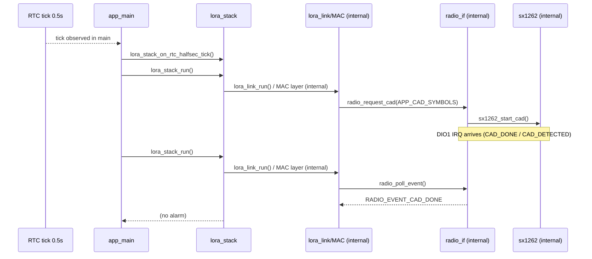

### 3.2 Heartbeat mỗi ~240s ± jitter

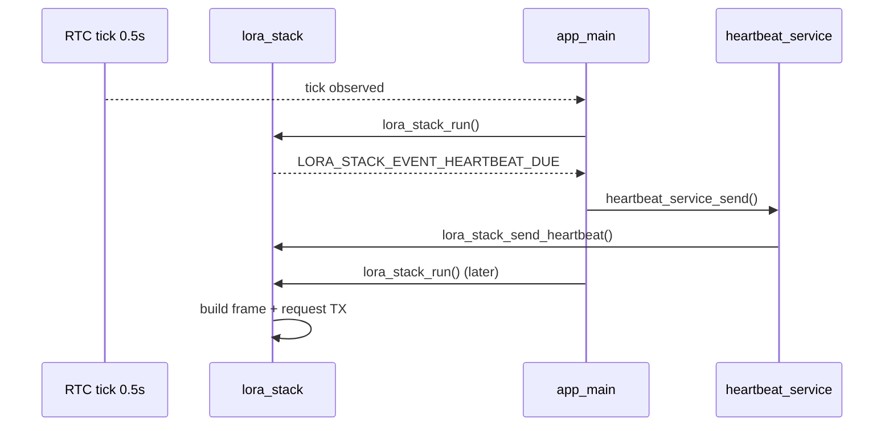

---

## 3.3 Join Mode (user-initiated connect setup)

Join Mode là một mode tạm thời để vào mạng theo thao tác người dùng.

**Behavior (theo code hiện tại):**

- Enter: `BUTTON_EVENT_CLICK_2` → `DEVICE_EVENT_BTN_JOIN_MODE_ENTER`
- While active:
  - LED xanh toggle mỗi 0.5s (`alarm_service_set_joining(1)`)
  - Radio sử dụng **channel index 0** (CH0 meeting point)
  - Gửi `JoinRequest` mỗi 1s
  - Sau mỗi TX JoinRequest: mở RX window dài hơn `APP_RX_AFTER_JOIN_TX_MS` để chờ `JoinAccept`
  - CAD paging bị tạm dừng
- Exit:
  - `BUTTON_EVENT_CLICK_1` → `DEVICE_EVENT_BTN_JOIN_MODE_EXIT`
  - Hoặc timeout 2 phút (`DEVICE_EVENT_JOIN_MODE_TIMEOUT`)
- Join success:
  - Nhận `JoinAccept` → `DEVICE_EVENT_LINK_JOIN_ACCEPTED` → thoát Join Mode
  - Lưu `channel index` vào Data Flash và switch sang kênh được cấp phát cho CAD/RX/TX sau đó
  - Hiển thị join-success: LED xanh toggle mỗi 1s trong vài giây

## 4) Time sync (gateway → node) — Protocol Layer

Theo protocol V2 (AES-128-CCM), gateway gửi `time_rtc(second)` (4 bytes, plaintext) trong **Extend** của:

- `JOIN_ACCEPT`
- `ACK`

Node sẽ set RTC theo giá trị `time_rtc` khi nhận được các frame hợp lệ này (xem [emic_lora_protocol_frame_spec.md](emic_lora_protocol_frame_spec.md) Mục 9).

**Layer:** Time sync verification là **Protocol layer responsibility** (xem [emic_lora_stack_architecture.md](emic_lora_stack_architecture.md) Mục 4: Protocol Layer).

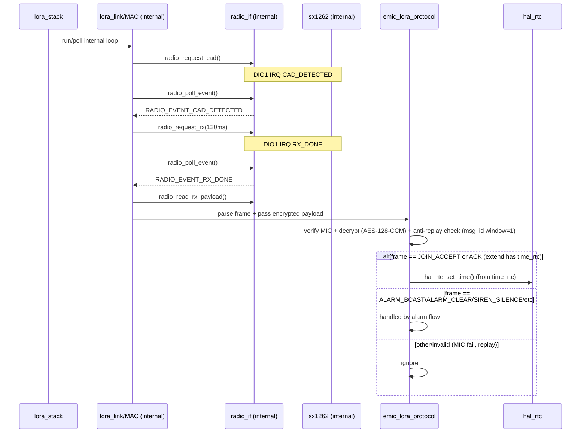

Ghi chú implementation:

- Firmware hiện tại set RTC khi nhận `time_rtc` từ `JOIN_ACCEPT`/`ACK`.
- Cờ `rtc_synced` dùng để quyết định có lưu `fire_start_epoch_s` khi vào ALARM.

---

## 5) Phát hiện mất kết nối Gateway (node-side ≤ 5 phút)

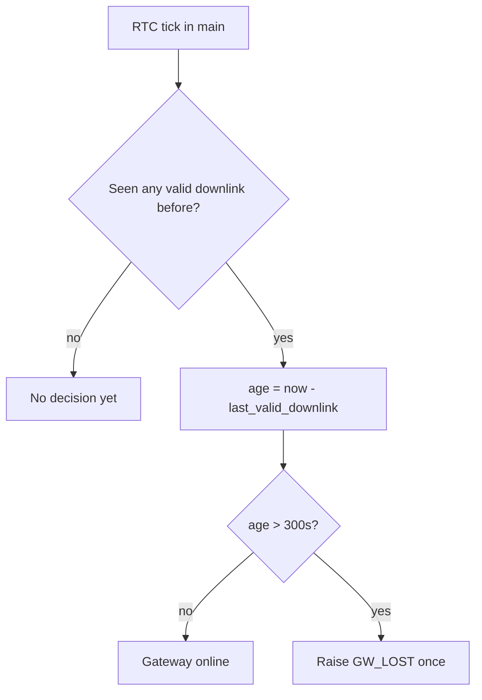

Ý nghĩa:

- "Gateway online" = trong vòng 300s gần nhất có **downlink hợp lệ**.
- Downlink hợp lệ thường là `ACK` sau các uplink (HEARTBEAT/ALARM/EXIT...), nên **không cần** một loại "beacon" riêng.
- Khi mất downlink > 300s, node **phát hiện** và phát event `GW_LOST` (1 lần cho mỗi lần transition).
- **Bảo mật:** "downlink hợp lệ" nghĩa là frame đã pass Protocol layer verification (MIC check + anti-replay check với msg_id window=1)

---

## 6) Luồng remote alarm (gateway → node kêu) — Protocol + MAC Layers

**Note:** Downlink alarm có thể bidirectional từ Protocol layer, nhưng MAC layer chỉ gửi ACK khi ACK_REQ=1 (xem [emic_lora_stack_architecture.md](emic_lora_stack_architecture.md) Mục 3.3).

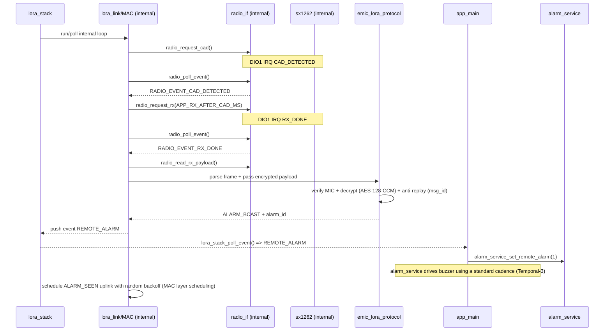

---

## 7) Luồng local alarm (smoke/button → node kêu + uplink) — Protocol + MAC Layers

**Note:** Local alarm uplink (ALARM_EVENT) được encrypt và xác thực bằng AES-128-CCM ở Protocol layer, sau đó gửi qua MAC layer với ACK request (xem [emic_lora_protocol_frame_spec.md](emic_lora_protocol_frame_spec.md) Mục 9.1).

### 7.1 Local alarm từ smoke sensor (dual-edge detection)

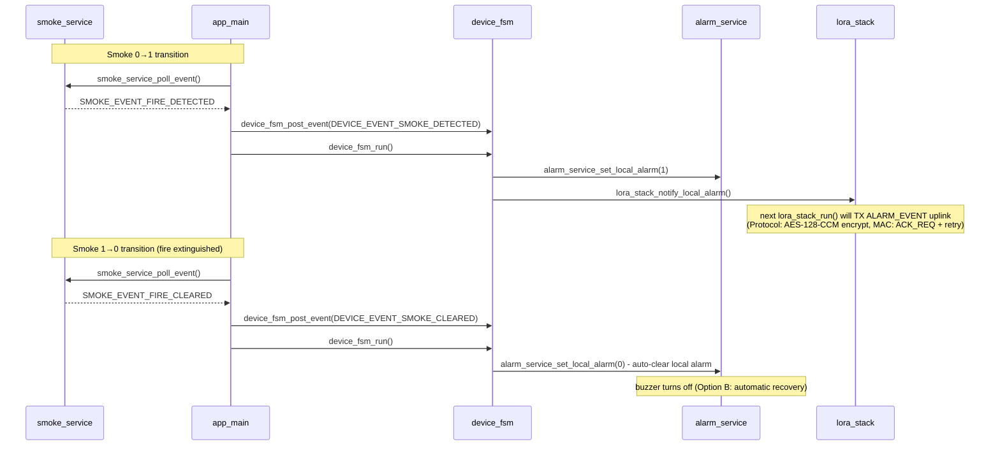

**Dual-edge detection logic:**

- `SMOKE_EVENT_FIRE_DETECTED` (0→1): phát hiện cháy → set local alarm + notify GW
- `SMOKE_EVENT_FIRE_CLEARED` (1→0): hết cháy → **auto-clear local alarm** (Option B)

**Policy notes:**

- Local alarm auto-clears khi cảm biến không còn phát hiện khói
- Remote alarm vẫn cần GW gửi ALARM_CLEAR/SIREN_SILENCE để clear (không auto-clear) — xem [emic_lora_protocol_frame_spec.md](emic_lora_protocol_frame_spec.md) Mục 9
- Button luôn có thể ack/hush local alarm nếu có dedicated gesture

### 7.2 Local alarm từ Button (gesture-level events mapped to business actions)

Button emits **gesture-level events only** (no business meaning).

Mapping rule (current architecture):

- `button` (driver) emits raw gestures.
- `app_main` maps raw gestures into **semantic application actions** (`DEVICE_EVENT_BTN_*`).
- `device_fsm` consumes semantic actions and executes policy/state-dependent behavior.

**Gesture events:**

- `BUTTON_EVENT_CLICK_1`: single tap
- `BUTTON_EVENT_CLICK_2`: double tap
- `BUTTON_EVENT_CLICK_3`: triple tap (reserved)
- `BUTTON_EVENT_CLICK_4`: 4 taps (used to arm EXIT)
- `BUTTON_EVENT_HOLD_1S`: hold ≥1000ms
- `BUTTON_EVENT_HOLD_3S`: hold ≥3000ms
- `BUTTON_EVENT_HOLD_5S`: hold ≥5000ms

**App mapping (gesture → semantic action):**

- HOLD_1S → `DEVICE_EVENT_BTN_TEST` (chỉ khi chưa joined và không ở Join Mode)
- CLICK_2 → `DEVICE_EVENT_BTN_JOIN_MODE_ENTER`
- CLICK_4 arms EXIT; next HOLD_3S emits `DEVICE_EVENT_BTN_EXIT`
- HOLD_5S → `DEVICE_EVENT_BTN_FACTORY_RESET`
- CLICK_1 → nếu Join Mode đang active: `DEVICE_EVENT_BTN_JOIN_MODE_EXIT`; nếu không: pre-join TEST (chưa joined) hoặc CONFIRM (đã joined)

**Device FSM behavior:**

- `DEVICE_EVENT_BTN_CONFIRM` → acknowledge/UI feedback (no state change)
- `DEVICE_EVENT_BTN_FACTORY_RESET` → blocked during alarm (safety-first)

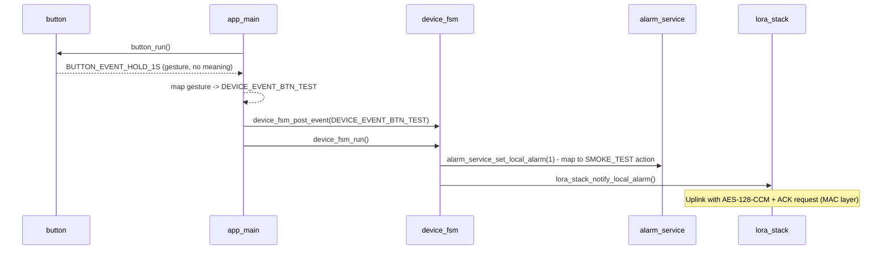

---

## 7.3) LED/Buzzer patterns (MVP + status indicators)

`alarm_service` là nơi duy nhất điều khiển output `buzzer/led`.

**Priority order (cao → thấp):**

- ALARM (local/remote)
- JOINING (Join Mode active)
- JOIN_SUCCESS (short indication after JoinAccept)
- PREJOIN_TEST (before joined)
- TEST (GW Test ED)
- FAULT
- LOW_BATT
- OFFLINE
- NORMAL

**Buzzer patterns:**

- ALARM: Temporal-3 (UL) — 0.5s ON / 0.5s OFF ×3, rồi 1.5s OFF (chu kỳ 4.5s)
- Remote silence (non-source nodes): nếu `remote_alarm=1` và `local_alarm=0` thì buzzer OFF trong 9 phút
- TEST: beep-beep (100ms ON, 100ms OFF, 100ms ON, 700ms OFF)
- FAULT: beep-beep rồi nghỉ dài (chu kỳ 5s)
- LOW_BATT: chirp 60ms mỗi 30s
- OFFLINE/NORMAL: buzzer OFF
- JOINING/JOIN_SUCCESS: buzzer OFF
- PREJOIN_TEST (before joined): buzzer toggle 0.5s ON / 0.5s OFF

**LED patterns:**

- ALARM: LED đỏ nhấp nháy 0.5s ON/OFF, LED xanh phản ánh flag `remote_alarm`
- TEST: blink cả hai LED 1Hz (0.5s ON / 0.5s OFF)
- FAULT: luân phiên RED/GREEN mỗi 0.5s
- LOW_BATT: RED nhấp nháy 0.5s ON mỗi 8s
- OFFLINE: RED nhấp nháy 0.5s ON mỗi 2s
- NORMAL: GREEN nhấp nháy 0.5s ON mỗi 60s
- JOINING: GREEN toggle mỗi 0.5s (RED OFF)
- JOIN_SUCCESS: GREEN toggle mỗi 1s trong vài giây (RED OFF)
- PREJOIN_TEST (before joined): RED toggle mỗi 0.5s (GREEN OFF)

---

## 8) Low-power rule (để không phá timing + không phá buzzer)

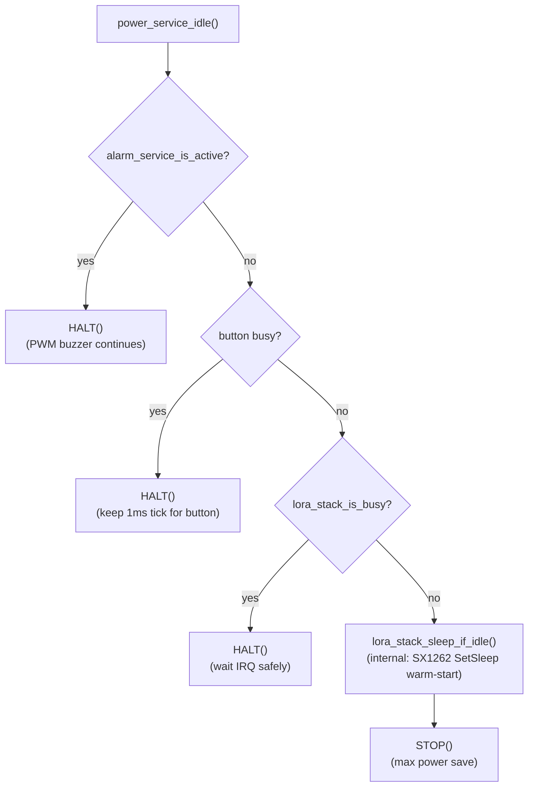

Ghi chú:

- `alarm_service_is_active()` hiện được hiểu là **buzzer pattern engine đang active** (cần giữ high-speed clocks).
- Khi buzzer kêu: phải tránh STOP vì STOP dừng high-speed clocks.
- Khi radio đang chờ IRQ (CAD/RX/TX): tránh STOP để không phụ thuộc khả năng wake DIO1 trong STOP.

---

## 9) Gợi ý "đọc code theo luồng" (rất nhanh)

- Entry: `src/EMIC_LORA_PROTOCOL.c` → `app_init()` → `app_run_forever()`
- Tick/timebase: `hal_rtc` + `app_on_rtc_tick_poll()`
- State machine chính (public boundary): `lora_stack_run()`
- ISR tối thiểu (public boundary): `lora_stack_on_dio1_irq()` + RTC ISR hook
- Output alarm: `alarm_service` → `buzzer`/`led`
