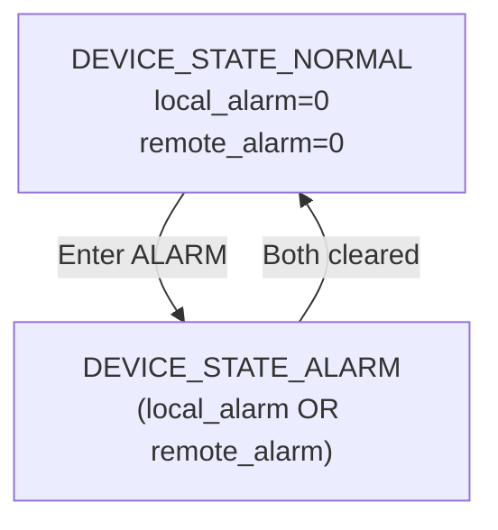
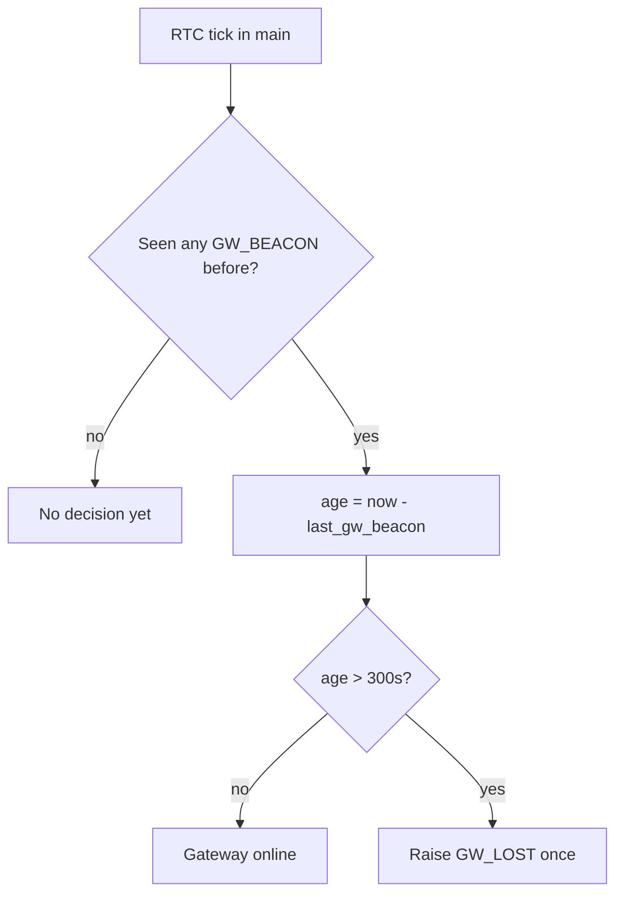
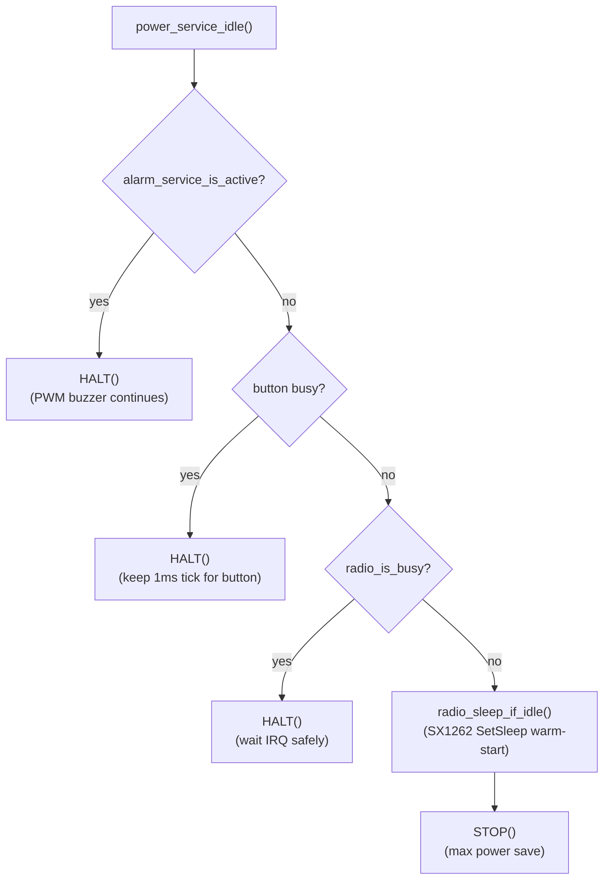

# Luồng hoạt động chính (runtime flow)

Mục tiêu: mô tả **1 cách trực quan nhất** "hệ thống chạy như thế nào" từ lúc boot đến các nhánh: bình thường, local alarm, remote alarm.

---

## 0) Tham số cấu hình chính (tóm tắt)

- Timebase hệ thống: **RTC tick 0.5s**
- CAD scan period: theo `APP_CAD_SCAN_PERIOD_MS` (hiện tại chọn **5.0s**)
- CAD symbols: 4
- RX after CAD hit: ~120 ms
- Heartbeat uplink: ~240 s ± jitter
- Gateway → Node: phát **GW_BEACON (DL, broadcast)** định kỳ (gợi ý 60–90s)
- Node gateway-lost: **> 300s** không thấy beacon hợp lệ (sau khi đã từng thấy beacon)

---

## 1) Boot flow

```mermaid
sequenceDiagram
  participant MAIN as main()
  participant APP as app_init()
  participant HAL as HAL/SMC init
  participant RADIO as radio_init()
  participant LINK as lora_link_init()

  MAIN->>HAL: EI() enable interrupts
  MAIN->>APP: app_init()
  APP->>HAL: hal_gpio_init()
  APP->>HAL: hal_timer_init() (TAU0_0 setup)
  APP->>HAL: hal_rtc_init() + enable 0.5s tick
  APP->>APP: alarm_service_init() / smoke_service_init()
  APP->>APP: heartbeat_service_init() / power_service_init()
  APP->>APP: nv_store_init()
  APP->>RADIO: radio_init() (sx1262_init)
  APP->>LINK: lora_link_init(net_id, dev_id)
```

---

## 2) Main loop (super-loop) — khung chạy chung

Vòng lặp nằm trong `app_run_forever()`:


**Luồng chi tiết:**

1. **Poll RTC tick** (`app_on_rtc_tick_poll()`): kiểm tra RTCIF flag.
2. **Run state machines**: update internal FSM states (không emit event ra ngoài):
   - `button_run()`: gesture recognition FSM (IDLE/PRESSED/WAIT_SECOND)
   - `lora_link_run()`: CAD/RX/TX FSM (IDLE/WAIT_CAD/WAIT_RX/WAIT_TX)
   - `alarm_service_run()`: buzzer pattern FSM
3. **Collect and post all events** (`app_collect_and_post_events()`):
   - Button gestures: loop poll → CLICK_1/CLICK_2/HOLD_1S/HOLD_3S/HOLD_5S
   - Link events: loop poll → HEARTBEAT_DUE/REMOTE_ALARM_ON/REMOTE_ALARM_OFF
   - Smoke sensor: loop poll → FIRE_DETECTED/FIRE_CLEARED (dual-edge detection)
4. **Dispatch FSM** (`device_fsm_run()`): drain event queue → state-dependent actions
5. **Power idle** (`power_service_idle()`): decide STOP vs HALT based on activity state

**Ghi chú về event collection pattern:**

- Mỗi event source dùng `for(;;)` loop poll cho đến khi nhận `NONE` event → break
- Tất cả events được post vào device_fsm ring buffer queue (capacity 8 slots)
- Nếu queue full → event dropped (logged nhưng không critical)

**Timebase hệ thống:**

- **RTC constant-period 0.5s** là tick chính của hệ thống (không phải 1ms SysTick)
- Button timing dùng `hal_systick_get_ms()` (ITL/FSXP), chỉ bật khi cần debounce/hold/double-click
- Hệ thống tắt systick khi idle để tiết kiệm năng lượng

---

## 2.1) Application state machine (device_fsm)

Trạng thái chính ở lớp Application hiện tại được quản lý bởi `device_fsm` (business state, không phải power state).

**States:**

- `DEVICE_STATE_NORMAL`: không có alarm
- `DEVICE_STATE_ALARM`: đang alarm (có thể do local smoke/button hoặc remote GW)

**Events có thể làm đổi state (state-transition events):**

- `DEVICE_EVENT_SMOKE_DETECTED`: set local alarm ON
- `DEVICE_EVENT_SMOKE_CLEARED`: set local alarm OFF (Option B: auto-clear)
- `DEVICE_EVENT_LINK_REMOTE_ALARM_ON`: set remote alarm ON
- `DEVICE_EVENT_LINK_REMOTE_ALARM_OFF`: set remote alarm OFF
- `DEVICE_EVENT_BTN_HOLD_1S`: (SMOKE_TEST) cũng set local alarm ON

**Ghi chú:**

- Mặc dù chỉ có 1 state `DEVICE_STATE_ALARM`, firmware vẫn track **2 nguồn alarm** nội bộ: `local_alarm` và `remote_alarm`.
- Điều này giúp xử lý đúng policy (ví dụ: remote alarm chỉ clear khi nhận ALARM_STOP/SILENCE từ GW; local alarm có thể auto-clear theo smoke sensor).

### 2.1.1) Cách nhìn dễ hơn (recommended): state = OR(local_alarm, remote_alarm)

Thay vì vẽ nhiều self-loop (khó đọc), hãy nhìn theo **2 cờ (flags)**:

- `local_alarm`: set/clear bởi smoke sensor (DETECTED/CLEARED) và SMOKE_TEST
- `remote_alarm`: set/clear bởi GW (REMOTE_ALARM_ON / REMOTE_ALARM_OFF)

Rule state:

- `DEVICE_STATE_ALARM` khi `(local_alarm != 0) || (remote_alarm != 0)`
- `DEVICE_STATE_NORMAL` khi `(local_alarm == 0) && (remote_alarm == 0)`



**Events that ENTER ALARM** (NORMAL → ALARM):
- `DEVICE_EVENT_SMOKE_DETECTED`: set `local_alarm=1`, notify GW
- `DEVICE_EVENT_BTN_HOLD_1S`: set `local_alarm=1`, notify GW
- `DEVICE_EVENT_LINK_REMOTE_ALARM_ON`: set `remote_alarm=1`

**Events while in ALARM** (stay in ALARM or update flag):
- `DEVICE_EVENT_SMOKE_DETECTED`: set `local_alarm=1`
- `DEVICE_EVENT_SMOKE_CLEARED`: clear `local_alarm=0` → exit only if `remote_alarm=0`
- `DEVICE_EVENT_LINK_REMOTE_ALARM_ON`: set `remote_alarm=1`
- `DEVICE_EVENT_LINK_REMOTE_ALARM_OFF`: clear `remote_alarm=0` → exit only if `local_alarm=0`

### 2.1.2) Bảng chuyển trạng thái (tham khảo)

| Event                                  |    local_alarm |   remote_alarm | State sau recompute                              |
| -------------------------------------- | -------------: | -------------: | ------------------------------------------------ |
| `DEVICE_EVENT_SMOKE_DETECTED`        |              1 | (giữ nguyên) | `ALARM`                                        |
| `DEVICE_EVENT_SMOKE_CLEARED`         |              0 | (giữ nguyên) | `ALARM` nếu remote=1, ngược lại `NORMAL` |
| `DEVICE_EVENT_LINK_REMOTE_ALARM_ON`  | (giữ nguyên) |              1 | `ALARM`                                        |
| `DEVICE_EVENT_LINK_REMOTE_ALARM_OFF` | (giữ nguyên) |              0 | `ALARM` nếu local=1, ngược lại `NORMAL`  |
| `DEVICE_EVENT_BTN_HOLD_1S`           |              1 | (giữ nguyên) | `ALARM`                                        |

**Events không làm đổi state (nhưng vẫn có action):**

- `DEVICE_EVENT_LINK_HEARTBEAT_DUE`: gửi heartbeat uplink
- `DEVICE_EVENT_BTN_CLICK_1/2`, `DEVICE_EVENT_BTN_HOLD_3S/5S`: phụ thuộc policy; một số gesture chỉ log/hook hoặc bị block khi đang alarm

---

## 3) Luồng bình thường (không có alarm)

### 3.1 CAD paging theo cấu hình (APP_CAD_SCAN_PERIOD_MS)

```mermaid
sequenceDiagram
  participant RTC as RTC tick 0.5s
  participant APP as app_main
  participant LINK as lora_link
  participant RADIO as radio_if
  participant SX as sx1262

  RTC-->>APP: tick observed in main
  APP->>LINK: lora_link_on_rtc_halfsec_tick()
  APP->>LINK: lora_link_run()
  LINK->>RADIO: radio_request_cad(APP_CAD_SYMBOLS)
  RADIO->>SX: sx1262_start_cad()

  Note over SX,RADIO: DIO1 IRQ arrives (CAD_DONE / CAD_DETECTED)
  APP->>LINK: lora_link_run()
  LINK->>RADIO: radio_poll_event()
  RADIO-->>LINK: RADIO_EVENT_CAD_DONE
  LINK-->>APP: (no alarm)
```

### 3.2 Heartbeat mỗi ~240s ± jitter

```mermaid
sequenceDiagram
  participant RTC as RTC tick 0.5s
  participant LINK as lora_link
  participant APP as app_main
  participant HB as heartbeat_service

  RTC-->>APP: tick observed
  APP->>LINK: lora_link_run()
  LINK-->>APP: LORA_LINK_EVENT_HEARTBEAT_DUE
  APP->>HB: heartbeat_service_send()
  HB->>LINK: lora_link_send_heartbeat()
  APP->>LINK: lora_link_run() (later)
  LINK->>LINK: build frame + request TX
```

---

## 4) GW_BEACON flow (gateway → node sync time)

### 4.1 Gateway behavior (gợi ý)

- Định kỳ phát **GW_BEACON** (broadcast) mỗi 60–90s.
- Mỗi lần phát nên là **burst** đủ dài để đi qua ít nhất 1 lần CAD scan của node.
  - Gợi ý: burst duration **≥ Tscan + 1s**.
- Nội dung beacon nên chứa thời gian RTC (sec/min/hour/day/week/month/year) để node đồng bộ.

### 4.2 Node behavior (nhận beacon)

```mermaid
sequenceDiagram
  participant LINK as lora_link
  participant RADIO as radio_if
  participant SX as sx1262
  participant PROTO as emic_lora_protocol
  participant HAL as hal_rtc

  LINK->>RADIO: radio_request_cad()
  Note over SX,RADIO: DIO1 IRQ CAD_DETECTED
  LINK->>RADIO: radio_poll_event()
  RADIO-->>LINK: RADIO_EVENT_CAD_DETECTED
  LINK->>RADIO: radio_request_rx(120ms)

  Note over SX,RADIO: DIO1 IRQ RX_DONE
  LINK->>RADIO: radio_poll_event()
  RADIO-->>LINK: RADIO_EVENT_RX_DONE
  LINK->>RADIO: radio_read_rx_payload()
  LINK->>PROTO: parse + verify CRC16 + decrypt (AES-ECB)

  alt frame == GW_BEACON
    LINK->>LINK: update last_gw_beacon_time
    LINK->>HAL: hal_rtc_set_time() (only first valid beacon)
  else frame == ALARM_BCAST
    LINK->>LINK: handled by alarm flow
  else other/invalid
    LINK->>LINK: ignore
  end
```

Ghi chú implementation:

- Node cập nhật `last_gw_beacon_time` mỗi khi nhận beacon hợp lệ.
- Node chỉ **set RTC** ở **beacon hợp lệ đầu tiên** (giảm rủi ro "giật giờ" liên tục).

---

## 5) Phát hiện mất kết nối Gateway (node-side ≤ 5 phút)



Ý nghĩa:

- "Gateway online" = trong vòng 300s gần nhất có beacon hợp lệ.
- Khi mất beacon > 300s, node **phát hiện** và phát event `GW_LOST` (1 lần cho mỗi lần transition).

---

## 6) Luồng remote alarm (gateway → node kêu)

```mermaid
sequenceDiagram
  participant LINK as lora_link
  participant RADIO as radio_if
  participant SX as sx1262
  participant PROTO as emic_lora_protocol
  participant APP as app_main
  participant ALARM as alarm_service

  LINK->>RADIO: radio_request_cad()
  Note over SX,RADIO: DIO1 IRQ CAD_DETECTED
  LINK->>RADIO: radio_poll_event()
  RADIO-->>LINK: RADIO_EVENT_CAD_DETECTED
  LINK->>RADIO: radio_request_rx(APP_RX_AFTER_CAD_MS)
  Note over SX,RADIO: DIO1 IRQ RX_DONE
  LINK->>RADIO: radio_poll_event()
  RADIO-->>LINK: RADIO_EVENT_RX_DONE
  LINK->>RADIO: radio_read_rx_payload()
  LINK->>PROTO: parse + verify CRC16 + decrypt (AES-ECB)
  PROTO-->>LINK: ALARM_BCAST + alarm_id
  LINK-->>APP: push event REMOTE_ALARM
  APP->>ALARM: alarm_service_set_remote_alarm(1)
  Note over APP: alarm_service drives buzzer using a standard cadence (Temporal-3)
  LINK->>LINK: schedule ALARM_SEEN uplink with random backoff
```

---

## 7) Luồng local alarm (smoke/button → node kêu + uplink)

### 7.1 Local alarm từ smoke sensor (dual-edge detection)

```mermaid
sequenceDiagram
  participant SMOKE as smoke_service
  participant APP as app_main
  participant FSM as device_fsm
  participant ALARM as alarm_service
  participant LINK as lora_link

  Note over SMOKE,APP: Smoke 0→1 transition
  APP->>SMOKE: smoke_service_poll_event()
  SMOKE-->>APP: SMOKE_EVENT_FIRE_DETECTED
  APP->>FSM: device_fsm_post_event(DEVICE_EVENT_SMOKE_DETECTED)
  APP->>FSM: device_fsm_run()
  FSM->>ALARM: alarm_service_set_local_alarm(1)
  FSM->>LINK: lora_link_notify_local_alarm()
  Note over LINK: next lora_link_run() will TX ALARM_EVENT uplink

  Note over SMOKE,APP: Smoke 1→0 transition (fire extinguished)
  APP->>SMOKE: smoke_service_poll_event()
  SMOKE-->>APP: SMOKE_EVENT_FIRE_CLEARED
  APP->>FSM: device_fsm_post_event(DEVICE_EVENT_SMOKE_CLEARED)
  APP->>FSM: device_fsm_run()
  FSM->>ALARM: alarm_service_set_local_alarm(0) - auto-clear local alarm
  Note over ALARM: buzzer turns off (Option B: automatic recovery)
```

**Dual-edge detection logic:**

- `SMOKE_EVENT_FIRE_DETECTED` (0→1): phát hiện cháy → set local alarm + notify GW
- `SMOKE_EVENT_FIRE_CLEARED` (1→0): hết cháy → **auto-clear local alarm** (Option B)

**Policy notes:**

- Local alarm auto-clears khi cảm biến không còn phát hiện khói
- Remote alarm vẫn cần GW gửi ALARM_STOP/SILENCE để clear (không auto-clear)
- Button luôn có thể ack/hush local alarm nếu có dedicated gesture

### 7.2 Local alarm từ Button (gesture-level events mapped to business actions)

Button emits **gesture-level events only** (no business meaning), device_fsm maps gestures to actions per state:

**Gesture events:**

- `BUTTON_EVENT_CLICK_1`: single tap
- `BUTTON_EVENT_CLICK_2`: double tap
- `BUTTON_EVENT_HOLD_1S`: hold ≥1000ms
- `BUTTON_EVENT_HOLD_3S`: hold ≥3000ms
- `BUTTON_EVENT_HOLD_5S`: hold ≥5000ms

**Device FSM mapping (DEVICE_STATE_NORMAL):**

- HOLD_1S → SMOKE_TEST: set local alarm + notify GW
- HOLD_3S → reserved (future hush feature)
- HOLD_5S → FACTORY_RESET: clear all alarms + reinit config
- CLICK_2 → JOIN_NETWORK: application hook
- CLICK_1 → CONFIRM: application hook

**Device FSM mapping (DEVICE_STATE_ALARM):**

- CLICK_1 → acknowledge/UI feedback (no action, safety-first)
- HOLD_5S → blocked (never allow factory reset during alarm)

```mermaid
sequenceDiagram
  participant BTN as button
  participant APP as app_main
  participant FSM as device_fsm
  participant ALARM as alarm_service
  participant LINK as lora_link

  APP->>BTN: button_run()
  BTN-->>APP: BUTTON_EVENT_HOLD_1S (gesture, no meaning)
  APP->>FSM: device_fsm_post_event(DEVICE_EVENT_BTN_HOLD_1S)
  APP->>FSM: device_fsm_run()
  FSM->>ALARM: alarm_service_set_local_alarm(1) - map to SMOKE_TEST action
  FSM->>LINK: lora_link_notify_local_alarm()
```

---

## 8) Low-power rule (để không phá timing + không phá buzzer)



Ghi chú:

- Khi buzzer kêu: phải tránh STOP vì STOP dừng high-speed clocks.
- Khi radio đang chờ IRQ (CAD/RX/TX): tránh STOP để không phụ thuộc khả năng wake DIO1 trong STOP.

---

## 9) Gợi ý "đọc code theo luồng" (rất nhanh)

- Entry: `src/EMIC_LORA_PROTOCOL.c` → `app_init()` → `app_run_forever()`
- Tick/timebase: `hal_rtc` + `app_on_rtc_tick_poll()`
- State machine chính: `lora_link_run()`
- ISR tối thiểu: `sx126x_dio1_irq_handler()` + RTC ISR hook
- Output alarm: `alarm_service` → `buzzer`/`led`
