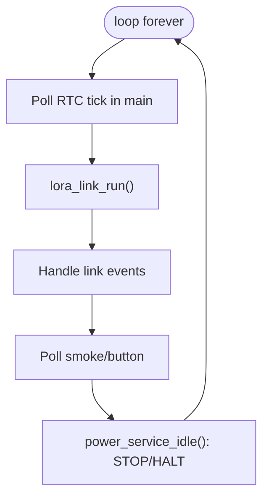
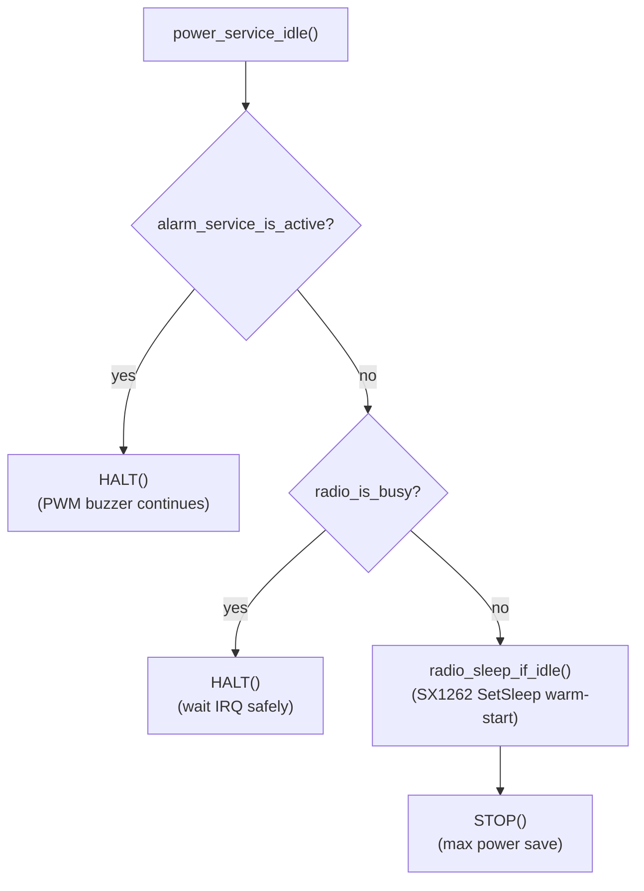

# Luồng hoạt động chính (runtime flow)

Mục tiêu: mô tả **1 cách trực quan nhất** “hệ thống chạy như thế nào” từ lúc boot đến các nhánh: bình thường, local alarm, remote alarm.

---

## 1) Boot flow

```mermaid
sequenceDiagram
  participant MAIN as main()
  participant APP as app_init()
  participant HAL as HAL/SMC init
  participant RADIO as radio_init()
  participant LINK as lora_link_init()

  MAIN->>HAL: EI() enable interrupts
  MAIN->>APP: app_init()
  APP->>HAL: hal_gpio_init()
  APP->>HAL: hal_timer_init() (TAU0_0 setup)
  APP->>HAL: hal_rtc_init() + enable 0.5s tick
  APP->>APP: alarm_service_init() / smoke_service_init()
  APP->>APP: heartbeat_service_init() / power_service_init()
  APP->>APP: nv_store_init()
  APP->>RADIO: radio_init() (sx1262_init)
  APP->>LINK: lora_link_init(net_id, dev_id)
```

---

## 2) Main loop (super-loop) — khung chạy chung

Vòng lặp nằm trong `app_run_forever()`:



Chi tiết 2 phần quan trọng:
- “Tick” của hệ thống là **RTC constant-period 0.5s** (không phải 1ms SysTick).
- `power_service_idle()` là điểm quyết định **STOP vs HALT**.

---

## 3) Luồng bình thường (không có alarm)

### 3.1 CAD paging mỗi ~2 giây

```mermaid
sequenceDiagram
  participant RTC as RTC tick 0.5s
  participant APP as app_main
  participant LINK as lora_link
  participant RADIO as radio_if
  participant SX as sx1262

  RTC-->>APP: tick observed in main
  APP->>LINK: lora_link_on_rtc_halfsec_tick()
  APP->>LINK: lora_link_run()
  LINK->>RADIO: radio_request_cad(APP_CAD_SYMBOLS)
  RADIO->>SX: sx1262_start_cad()

  Note over SX,RADIO: DIO1 IRQ arrives (CAD_DONE / CAD_DETECTED)
  APP->>LINK: lora_link_run()
  LINK->>RADIO: radio_poll_event()
  RADIO-->>LINK: RADIO_EVENT_CAD_DONE
  LINK-->>APP: (no alarm)
```

### 3.2 Heartbeat mỗi ~240s ± jitter

```mermaid
sequenceDiagram
  participant RTC as RTC tick 0.5s
  participant LINK as lora_link
  participant APP as app_main
  participant HB as heartbeat_service

  RTC-->>APP: tick observed
  APP->>LINK: lora_link_run()
  LINK-->>APP: LORA_LINK_EVENT_HEARTBEAT_DUE
  APP->>HB: heartbeat_service_send()
  HB->>LINK: lora_link_send_heartbeat()
  APP->>LINK: lora_link_run() (later)
  LINK->>LINK: build frame + request TX
```

---

## 4) Luồng remote alarm (gateway → node kêu)

```mermaid
sequenceDiagram
  participant LINK as lora_link
  participant RADIO as radio_if
  participant SX as sx1262
  participant PROTO as lora_frame/lora_crypto
  participant APP as app_main
  participant ALARM as alarm_service

  LINK->>RADIO: radio_request_cad()
  Note over SX,RADIO: DIO1 IRQ CAD_DETECTED
  LINK->>RADIO: radio_poll_event()
  RADIO-->>LINK: RADIO_EVENT_CAD_DETECTED
  LINK->>RADIO: radio_request_rx(APP_RX_AFTER_CAD_MS)
  Note over SX,RADIO: DIO1 IRQ RX_DONE
  LINK->>RADIO: radio_poll_event()
  RADIO-->>LINK: RADIO_EVENT_RX_DONE
  LINK->>RADIO: radio_read_rx_payload()
  LINK->>PROTO: parse + verify MIC + decrypt (GroupKey)
  PROTO-->>LINK: ALARM_BCAST + alarm_id
  LINK-->>APP: push event REMOTE_ALARM
  APP->>ALARM: alarm_service_set_remote_alarm(1)
  Note over APP: alarm_service toggles beep phase each 0.5s tick
  LINK->>LINK: schedule ALARM_SEEN uplink with random backoff
```

---

## 5) Luồng local alarm (smoke/button → node kêu + uplink)

```mermaid
sequenceDiagram
  participant SMOKE as smoke_service
  participant APP as app_main
  participant ALARM as alarm_service
  participant LINK as lora_link

  APP->>SMOKE: smoke_service_poll_alarm_trigger()
  SMOKE-->>APP: true
  APP->>ALARM: alarm_service_set_local_alarm(1)
  APP->>LINK: lora_link_notify_local_alarm()
  Note over LINK: next lora_link_run() when idle will TX ALARM_EVENT
```

---

## 6) Low-power rule (để không phá timing + không phá buzzer)



Ghi chú:
- Khi buzzer kêu: phải tránh STOP vì STOP dừng high-speed clocks.
- Khi radio đang chờ IRQ (CAD/RX/TX): tránh STOP để không phụ thuộc khả năng wake DIO1 trong STOP.

---

## 7) Gợi ý “đọc code theo luồng” (rất nhanh)

- Entry: `src/EMIC_LORA_PROTOCOL.c` → `app_init()` → `app_run_forever()`
- Tick/timebase: `hal_rtc` + `app_on_rtc_tick_poll()`
- State machine chính: `lora_link_run()`
- ISR tối thiểu: `sx126x_dio1_irq_handler()` + RTC ISR hook
- Output alarm: `alarm_service` → `buzzer`/`led`
