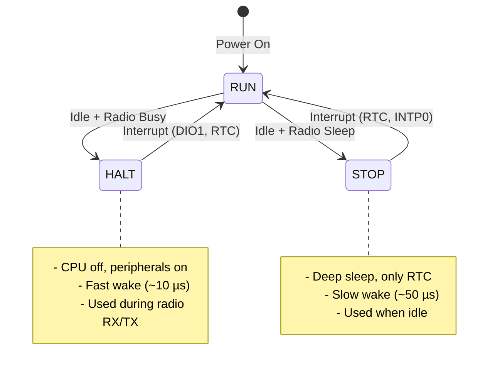

# EMIC LoRa Firmware Software Architecture

**Phiên bản:** 1.0.0  
**Ngày:** 20 Tháng 1, 2026  
**Mục đích:** Kiến trúc phần mềm toàn hệ thống (System-wide software architecture)

---

## 📚 Related Documents

- [emic_lora_stack_architecture.md](emic_lora_stack_architecture.md) - Protocol/MAC/PHY stack architecture
- [layer_call_flow.md](layer_call_flow.md) - Call flow and dependencies
- [state_machines.md](state_machines.md) - Device FSM, MAC state, Radio state
- [critical_flows.md](critical_flows.md) - Main loop, join, alarm, retry logic

---

## 1. System Overview

### 1.1. Product Context

**EMIC LoRa Fire Safety Network** là hệ thống wireless IoT cho phát hiện và cảnh báo hỏa hoạn:

- **End Device (ED):** Smoke sensor, siren, manual button (chạy pin)
- **Gateway (GW):** Trạm trung tâm (nguồn điện) kết nối ED và relay ALARM qua backbone mesh

**Target Platform:**
- MCU: Renesas RL78/G23 (R7F100GGG)
- Radio: Semtech SX1262 LoRa transceiver
- IDE: Renesas e² studio + CC-RL compiler
- RTOS: None (bare-metal super-loop)

---

## 2. Firmware Architecture

### 2.1. Layered Architecture Diagram

```
┌─────────────────────────────────────────────────────────────┐
│                    APPLICATION LAYER                        │
│  - app_main.c (super-loop)                                  │
│  - device_fsm (state machine: UNJOINED/IDLE/ALARM/...)     │
└─────────────────────┬───────────────────────────────────────┘
                      │ Events & Commands
┌─────────────────────┴───────────────────────────────────────┐
│                    SERVICE LAYER                            │
│  - lora_service (LoRa stack facade)                         │
│  - alarm_service (buzzer/LED patterns)                      │
│  - button_service (gesture detection)                       │
│  - smoke_service (analog sensor polling)                    │
│  - power_service (sleep/wake orchestrator)                  │
│  - nv_store_service (key/identity persistence)              │
└─────────────────────┬───────────────────────────────────────┘
                      │ Service API
┌─────────────────────┴───────────────────────────────────────┐
│              EMIC LORA STACK (3 layers) ⭐                  │
│  ┌────────────────────────────────────────────────────┐     │
│  │ PROTOCOL LAYER                                     │     │
│  │ - emic_lora_protocol (frame build/parse)           │     │
│  │ - emic_lora_backbone (GW dedup/TTL) [GW-only]     │     │
│  │ - emic_lora_crypto (AES-128-CCM)                   │     │
│  └────────────────────┬───────────────────────────────┘     │
│  ┌────────────────────┴───────────────────────────────┐     │
│  │ MAC LAYER                                          │     │
│  │ - lora_mac (ACK/Retry, channel access, scheduling) │     │
│  └────────────────────┬───────────────────────────────┘     │
│  ┌────────────────────┴───────────────────────────────┐     │
│  │ PHY LAYER                                          │     │
│  │ - radio_if (API abstraction)                       │     │
│  │ - sx1262 (SX1262 driver)                           │     │
│  └────────────────────────────────────────────────────┘     │
└─────────────────────┬───────────────────────────────────────┘
                      │ Driver API
┌─────────────────────┴───────────────────────────────────────┐
│                    DRIVER LAYER                             │
│  - nv_store (dataflash persistence)                         │
│  - smoke_sensor (ADC + analog read)                         │
│  - button (GPIO + debounce)                                 │
│  - led (GPIO + patterns)                                    │
│  - buzzer (PWM + tone generator)                            │
└─────────────────────┬───────────────────────────────────────┘
                      │ HAL API
┌─────────────────────┴───────────────────────────────────────┐
│                    HAL LAYER                                │
│  - hal_rtc (RTC for timebase + wake)                        │
│  - hal_spi (SPI for SX1262 communication)                   │
│  - hal_gpio (GPIO for DIO1, LED, button)                    │
│  - hal_timer (TAU for buzzer PWM)                           │
│  - hal_systick (ITL for 1ms timing)                         │
│  - hal_intc (interrupt controller)                          │
│  - hal_dataflash (dataflash read/write)                     │
└─────────────────────┬───────────────────────────────────────┘
                      │ Register Access
┌─────────────────────┴───────────────────────────────────────┐
│                  SMC_GEN (Hardware Config)                  │
│  - Config_RTC (RTC ISR)                                     │
│  - Config_INTC (DIO1 ISR - INTP0)                           │
│  - Config_TAU0_0 (PWM for buzzer)                           │
│  - Config_ITL000_ITL001_ITL012_ITL013 (systick)             │
│  - Config_CSI20 (SPI)                                       │
│  - Config_UARTA1 (debug UART)                               │
│  - Config_PORT (GPIO init)                                  │
│  - r_bsp (board support package)                            │
│  - r_rfd_rl78_dataflash (Renesas dataflash lib)             │
└─────────────────────────────────────────────────────────────┘
```

---

### 2.2. Module Count & Organization

| Layer         | Modules | LOC Estimate | Description                    |
|---------------|---------|--------------|--------------------------------|
| Application   | 2       | ~800         | Main loop + device FSM         |
| Service       | 6       | ~2000        | Business logic facade          |
| LoRa Stack    | 8       | ~3500        | Protocol/MAC/PHY stack         |
| Driver        | 5       | ~1200        | Peripheral drivers             |
| HAL           | 7       | ~800         | Hardware abstraction           |
| SMC_gen       | 20+     | ~15000       | Renesas auto-generated code    |
| **TOTAL**     | **48+** | **~23300**   | Full firmware                  |

---

## 3. Build Configurations

### 3.1. Build Variants

| Variant            | Target Device | Features                       | Compile Flag       |
|--------------------|---------------|--------------------------------|--------------------|
| **ED (Smoke)**     | Smoke sensor  | Sensor polling, low power      | `DEVICE_TYPE=2`    |
| **ED (Siren)**     | Siren         | Buzzer/LED control             | `DEVICE_TYPE=0`    |
| **ED (Button)**    | Manual button | Button gesture                 | `DEVICE_TYPE=3`    |
| **GW**             | Gateway       | Backbone mesh, beacon          | `GATEWAY_BUILD=1`  |

### 3.2. Compilation Flags

**Defined in:** `src/user/config/system_config.h` + build scripts

| Flag                      | Purpose                              | Default | ED | GW |
|---------------------------|--------------------------------------|---------|----|----|
| `SYSTEM_USE_CRYPTO`       | Enable AES-128-CCM encryption        | 1       | ✅  | ✅  |
| `SYSTEM_DEVICE_TYPE`      | Device type (0=siren, 2=smoke, etc.) | 2       | ✅  | ❌  |
| `SYSTEM_STOP_DURING_RADIO`| Allow STOP mode during radio         | 1       | ✅  | ⚠️  |
| `GATEWAY_BUILD`           | Enable backbone mesh logic           | (undef) | ❌  | ✅  |
| `DEBUG_BUILD`             | Enable debug UART, verbose logs      | (undef) | ⚠️  | ⚠️  |

**Conditional compilation:**
```c
#ifdef GATEWAY_BUILD
  #include "emic_lora_backbone.h"
  // GW-specific code (beacon, mesh relay)
#else
  // ED-specific code (sensor polling, sleep)
#endif
```

### 3.3. Build Toolchain

**Compiler:** Renesas CC-RL (CCRL)
- Language: C99 (`-lang=c99`)
- Optimization: `-O2` (HardwareDebug), `-O4` (Release)
- Debug: `-g` (generate debug info)

**Build Methods:**
1. **e² studio GUI:** Project → Build (headless via `build-e2studio-headless.ps1`)
2. **Makefile:** `scripts/build-ccrl-make.ps1` (faster for CI/CD)

**Output:**
- `HardwareDebug/EMIC_LORA_PROTOCOL.mot` (Motorola S-record)
- `HardwareDebug/EMIC_LORA_PROTOCOL.map` (memory map)

---

## 4. Memory Architecture

### 4.1. RL78/G23 Memory Map

| Region        | Address Range      | Size   | Usage                          |
|---------------|--------------------|--------|--------------------------------|
| Flash (Code)  | 0x00000 - 0x1FFFF  | 128 KB | Firmware code + const data     |
| Data Flash    | 0xF1000 - 0xF1FFF  | 4 KB   | Keys, identity, msg_id         |
| RAM           | 0xFEF00 - 0xFFEFF  | 16 KB  | Stack, heap, globals           |
| SFR           | 0xFFF00 - 0xFFFFF  | 256 B  | Special function registers     |

### 4.2. Flash Layout

```
┌─────────────────────────────────┐ 0x00000
│  Vector Table (64 bytes)        │
├─────────────────────────────────┤ 0x00040
│  Firmware Code                  │
│  - Application                  │
│  - Services                     │
│  - LoRa Stack                   │
│  - Drivers                      │
│  - HAL                          │
│  - SMC_gen                      │
├─────────────────────────────────┤ ~0x1D000 (typical)
│  Const Data                     │
│  - String literals              │
│  - Lookup tables                │
│  - Pre-provisioned keys         │
├─────────────────────────────────┤ ~0x1F000
│  Reserved / Unused              │
└─────────────────────────────────┘ 0x1FFFF
```

**Typical sizes (Release build):**
- Code: ~100 KB
- Const data: ~10 KB
- Available: ~18 KB

### 4.3. RAM Layout

```
┌─────────────────────────────────┐ 0xFEF00 (Low RAM)
│  Initialized Data (.data)       │
│  - Global variables             │
│  - Static variables             │
├─────────────────────────────────┤ ~0xFF000
│  Uninitialized Data (.bss)      │
│  - Zero-init globals            │
├─────────────────────────────────┤ ~0xFF400
│  Heap (malloc - NOT USED)       │ (0 bytes - no dynamic alloc)
├─────────────────────────────────┤
│  Stack (grows downward) ⬇️       │
│  - Local variables              │
│  - Function call frames         │
│  - ISR context save             │
└─────────────────────────────────┘ 0xFFEFF (Stack top)
```

**Memory allocation policy:**
- ❌ **NO dynamic allocation** (no `malloc()`)
- ✅ **Static allocation only** (compile-time size known)
- ✅ **Fixed-size buffers** (e.g., 64B frame buffer, 16-entry dedup table)

**Typical RAM usage:**
- `.data` + `.bss`: ~4 KB
- Stack: ~2 KB (configured in linker)
- Available: ~10 KB

### 4.4. Data Flash Layout (Persistent Storage)

```
┌─────────────────────────────────┐ 0xF1000
│  NV Store Header (16 bytes)     │
│  - Magic number                 │
│  - Version                      │
│  - CRC                          │
├─────────────────────────────────┤ 0xF1010
│  Device Identity (32 bytes)     │
│  - net_id (6B)                  │
│  - short_addr (2B)              │
│  - seri_ed (6B)                 │
│  - Reserved                     │
├─────────────────────────────────┤ 0xF1030
│  Crypto Keys (64 bytes)         │
│  - K0 (16B bootstrap key)       │
│  - K1 (16B operational key)     │
│  - mesh_id (6B, GW only)        │
│  - Reserved                     │
├─────────────────────────────────┤ 0xF1070
│  Protocol State (32 bytes)      │
│  - msg_id_counter (4B)          │
│  - last_msg_id_table (GW only)  │
│  - Reserved                     │
├─────────────────────────────────┤ 0xF1090
│  Application Data (128 bytes)   │
│  - Alarm history                │
│  - Configuration                │
│  - Reserved                     │
├─────────────────────────────────┤ 0xF1110
│  Reserved for Future Use        │
└─────────────────────────────────┘ 0xF1FFF
```

**Write endurance:** 100K cycles (per Renesas spec)
**Retention:** 20 years @ 85°C

---

## 5. Concurrency Model

### 5.1. Execution Model: Bare-Metal Super-Loop

**NO RTOS** - Single-threaded cooperative multitasking

```c
int main(void) {
    system_init();
    device_fsm_init();
    lora_service_init();
    // ... other service inits

    while (1) {  // Super-loop
        // 1. Run services (poll-based)
        button_service_run();
        smoke_service_run();
        lora_service_run();
        alarm_service_run();
        
        // 2. Collect events
        device_fsm_post_event(button_event);
        device_fsm_post_event(lora_event);
        device_fsm_post_event(smoke_event);
        
        // 3. Process FSM
        device_fsm_run();  // State transitions
        
        // 4. Enter low-power mode
        power_service_idle();  // HALT or STOP
    }
}
```

**Characteristics:**
- ✅ Simple, deterministic
- ✅ No context switching overhead
- ✅ No priority inversion
- ❌ No preemption (long tasks block others)
- ❌ Requires careful timing budget

### 5.2. Interrupt Service Routines (ISRs)

**ISR design principle:** **Keep ISRs short** - set flag, exit quickly

| ISR                | Priority | Trigger           | Action                      | Latency |
|--------------------|----------|-------------------|-----------------------------|---------|
| **RTC (0.5s)**     | High     | INTRTC (periodic) | Increment tick counter      | <10 µs  |
| **DIO1 (Radio)**   | High     | INTP0 (edge)      | Set `s_irq_pending` flag    | <20 µs  |
| **ITL (1ms)**      | Medium   | INTITL (periodic) | Increment systick counter   | <10 µs  |
| **SPI (optional)** | Low      | INTCSI20          | Set transfer complete flag  | <15 µs  |

**ISR → Main Loop Communication:**
```c
// ISR: Set flag
volatile uint8_t s_irq_pending = 0;

void r_intc_intp0_interrupt(void) {  // DIO1 ISR
    s_irq_pending = 1;  // Radio interrupt
}

// Main loop: Poll flag
void radio_poll_event(void) {
    if (s_irq_pending) {
        s_irq_pending = 0;
        // Read IRQ status from SX1262
        // Process event
    }
}
```

### 5.3. Critical Sections

**No OS mutex** - Use interrupt disable/enable

```c
void critical_section_begin(void) {
    DI();  // Disable interrupts (RL78 instruction)
}

void critical_section_end(void) {
    EI();  // Enable interrupts
}

// Example: Protect msg_id increment
critical_section_begin();
msg_id_counter++;
nv_store_write_msg_id(msg_id_counter);  // Persist to dataflash
critical_section_end();
```

**Critical section rules:**
1. Keep duration **< 100 µs** (avoid missing RTC tick)
2. No function calls inside (except inline)
3. No I/O operations (SPI, UART, dataflash)

---

## 6. Power Management

### 6.1. Power Modes

| Mode    | CPU  | Peripherals      | Wake Source           | Current  | Entry               |
|---------|------|------------------|-----------------------|----------|---------------------|
| RUN     | ON   | All active       | -                     | ~5 mA    | Normal execution    |
| HALT    | OFF  | Some active      | Any interrupt         | ~150 µA  | `HALT()`            |
| STOP    | OFF  | RTC + INTP only  | RTC, INTP0 (DIO1)     | ~2 µA    | `STOP()`            |
| SNOOZE  | OFF  | ADC active       | ADC completion        | ~50 µA   | `STOP()` + SNOOZE   |

### 6.2. Power State Machine



**Power service logic:**
```c
void power_service_idle(void) {
    if (alarm_service_is_active()) {
        HALT();  // Keep PWM running for buzzer
    } else if (lora_service_is_busy() && !SYSTEM_STOP_DURING_RADIO) {
        HALT();  // Wait for DIO1 in HALT mode
    } else if (button_is_busy()) {
        HALT();  // Keep timing for gesture
    } else {
        lora_service_sleep();  // SX1262 → SLEEP mode
        STOP();                // MCU → STOP mode
    }
}
```

### 6.3. Wake Sources

| Source         | ISR              | Wake from STOP | Wake from HALT | Purpose                |
|----------------|------------------|----------------|----------------|------------------------|
| RTC (0.5s)     | INTRTC           | ✅             | ✅             | Timebase, heartbeat    |
| DIO1 (Radio)   | INTP0            | ✅             | ✅             | Radio events           |
| Button         | INTP1            | ✅             | ✅             | User input             |
| ITL (1ms)      | INTITL           | ❌             | ✅             | Systick (buzzer PWM)   |

---

## 7. Configuration Management

### 7.1. Configuration Files

| File                 | Layer         | Purpose                          | Can Include        |
|----------------------|---------------|----------------------------------|--------------------|
| `system_config.h`    | System-wide   | RF, MAC, Protocol constants      | HAL headers        |
| `app_config.h`       | Application   | App logic (FSM timeouts, etc.)   | `system_config.h`  |
| `r_bsp_config.h`     | BSP           | MCU clocks, peripherals          | -                  |

**Layering rules:**
- ✅ Upper layers can include lower config
- ❌ Lower layers CANNOT include upper config
- ❌ HAL/drivers must NOT include `app_config.h`

### 7.2. Key Configuration Parameters

**RF (in `system_config.h`):**
```c
#define SYSTEM_RF_FREQ_HZ           920225000UL  // 920.225 MHz
#define SYSTEM_RF_TX_POWER_DBM      14           // +14 dBm
#define SYSTEM_LORA_SF              7            // SF7
#define SYSTEM_LORA_BW              125000UL     // 125 kHz BW
```

**MAC Timing (in `system_config.h`):**
```c
#define SYSTEM_CAD_SCAN_PERIOD_MS   5000U        // CAD every 5s
#define SYSTEM_RX_AFTER_CAD_MS      120U         // RX window 120ms
#define SYSTEM_HEARTBEAT_PERIOD_S   240U         // Heartbeat every 4min
```

**Application (in `app_config.h`):**
```c
#define APP_BUTTON_LONG_PRESS_MS    3000U        // Long press 3s
#define APP_ALARM_AUTO_CLEAR_S      300U         // Auto-clear after 5min
```

---

## 8. Dependency Management

### 8.1. External Libraries

| Library      | Version | Purpose                  | License     | Size   |
|--------------|---------|--------------------------|-------------|--------|
| tinycrypt    | 0.2.8   | AES-128-CCM crypto       | BSD-3       | ~2 KB  |
| r_bsp        | Renesas | Board support package    | Proprietary | ~5 KB  |
| r_rfd        | Renesas | Dataflash driver         | Proprietary | ~3 KB  |

**Location:** `src/lib/tinycrypt/`, `src/smc_gen/r_bsp/`, `src/smc_gen/r_rfd_rl78_dataflash/`

### 8.2. Module Dependency Graph

```
app_main.c
  ↓ includes
device_fsm.h
  ↓ includes
lora_service.h
  ↓ includes
lora_mac.h
  ↓ includes
emic_lora_protocol.h
  ↓ includes
emic_lora_crypto.h
  ↓ includes
tinycrypt/aes.h
```

**Dependency rules:**
1. ✅ Lower layers can be used by multiple upper layers
2. ❌ Upper layers CANNOT be included by lower layers
3. ❌ Circular dependencies are forbidden

---

## 9. Debugging & Diagnostics

### 9.1. Debug UART

**When enabled** (`DEBUG_BUILD=1`):
- UART1: 115200 baud, 8N1
- Logs: frame RX/TX, state transitions, errors

**Example log:**
```
[LORA] TX: TYPE=HEARTBEAT, msg_id=42, len=6
[LORA] RX: TYPE=ACK, msg_id=42, status=OK
[FSM] IDLE → ALARM (smoke detected)
[ALARM] Fire event, buzzer ON
```

### 9.2. LED Indicators

| LED State      | Pattern            | Meaning                  |
|----------------|--------------------|--------------------------|
| Fast blink     | 100ms ON/OFF       | Joining network          |
| Slow blink     | 1s ON/OFF          | Idle, joined             |
| Solid ON       | Always ON          | Alarm active             |
| OFF            | Always OFF         | Unjoined or low battery  |

### 9.3. Assert & Error Handling

```c
// Custom assert (halt in debug, reset in release)
#ifdef DEBUG_BUILD
  #define ASSERT(cond) if(!(cond)) { while(1); }  // Halt
#else
  #define ASSERT(cond) if(!(cond)) { RESET(); }   // Watchdog reset
#endif
```

---

## 10. Testing Strategy

### 10.1. Testing Pyramid

```
        /\
       /  \      Unit Tests (60%)
      /____\     - Per-module function tests
     /      \    Integration Tests (30%)
    /________\   - Multi-module interaction
   /          \  System Tests (10%)
  /____________\ - End-to-end scenarios
```

### 10.2. Test Environments

| Level         | Environment        | Tools                  | Coverage Target |
|---------------|--------------------|------------------------|-----------------|
| Unit          | Host PC (x86)      | CTest, mock HAL        | 80%             |
| Integration   | Hardware (RL78)    | e² debugger, logic analyzer | 60%      |
| System        | Multi-device setup | RF sniffer, oscilloscope | Key scenarios |

---

## 11. Build Process

### 11.1. Build Flow


### 11.2. Build Commands

**Build (Makefile):**
```powershell
.\scripts\build-ccrl-make.ps1 -Config HardwareDebug -Target all
```

**Build (e² studio headless):**
```powershell
.\scripts\build-e2studio-headless.ps1 -ProjectName EMIC_LORA_PROTOCOL -Config HardwareDebug
```

**Flash:**
```powershell
.\scripts\flash-rfp.ps1 -ImageFile .\HardwareDebug\EMIC_LORA_PROTOCOL.mot
```

---

## 12. Version Control

**Repository:** `vuvantruong120896/emic_lora_protocol`
**Branching strategy:**
- `emic_lora_node_ver_1.0.0` (default branch - stable v1)
- `emic_lora_node_ver_2.0.0` (current - v2 with backbone mesh)
- `feature/*` (feature branches)

---

## 13. Future Enhancements

### 13.1. Planned Features

- [ ] OTA firmware update (over LoRa)
- [ ] Multi-channel frequency hopping
- [ ] Mesh routing optimization (AODV-like)
- [ ] Sleep scheduling coordination (beacon sync)

### 13.2. Known Limitations

- ⚠️ No mesh routing for ED (star only)
- ⚠️ Single-threaded (long tasks block super-loop)
- ⚠️ Fixed 128 KB flash (large features need external flash)
- ⚠️ 16 KB RAM (limits buffer sizes)

---

## 14. References

### 14.1. Hardware

- [RL78/G23 User Manual](https://www.renesas.com/en-us/doc/products/mpumcu/001/r01uh0897ej0130-rl78g23.pdf)
- [SX1262 Datasheet](https://www.semtech.com/products/wireless-rf/lora-core/sx1262)

### 14.2. Software

- [CC-RL Compiler User Manual](https://www.renesas.com/en-us/doc/products/tool/r01us0445ej0700-ccrl.pdf)
- [e² studio IDE Guide](https://www.renesas.com/en-us/software-tool/e-studio)

### 14.3. Standards

- LoRaWAN Specification 1.0.4
- IEEE 802.15.4 (Zigbee PHY/MAC reference)
- NIST SP 800-38C (AES-CCM)

---

**Document Status:** ✅ Ready for Review  
**Next Review:** 2026-02-20
