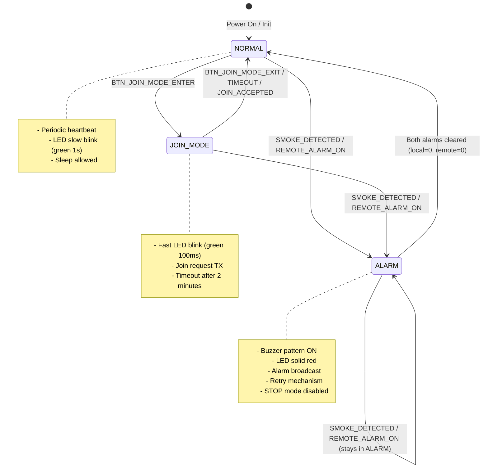
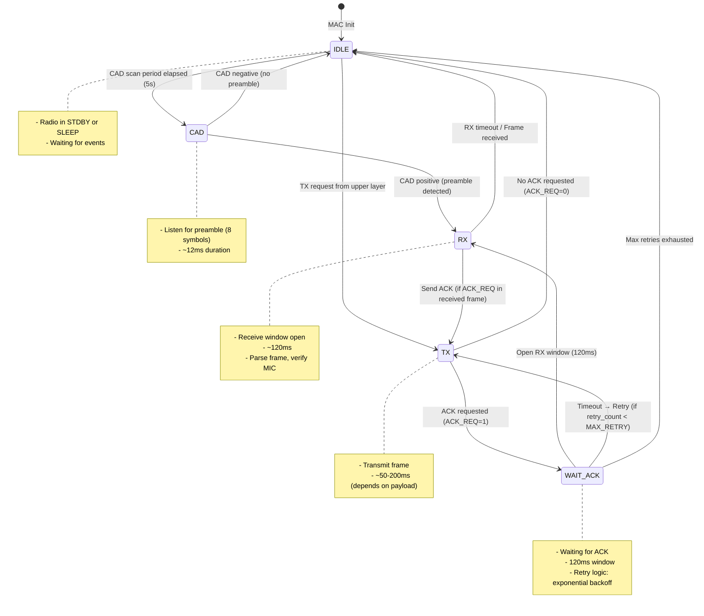
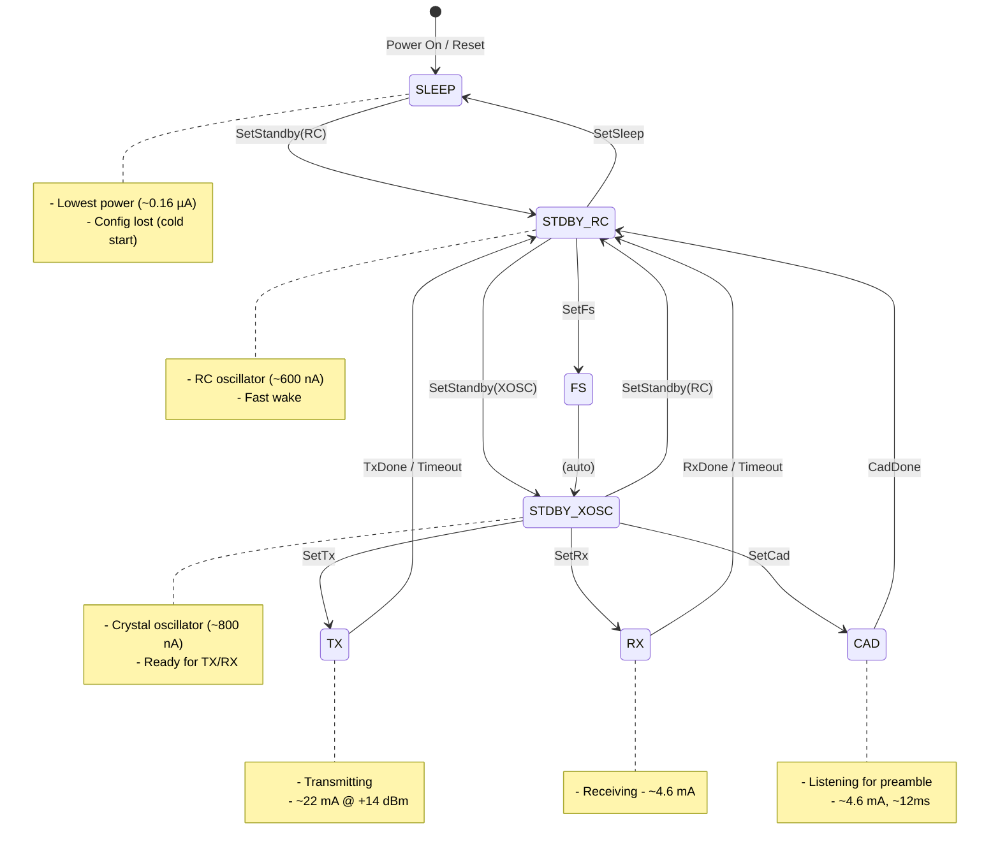
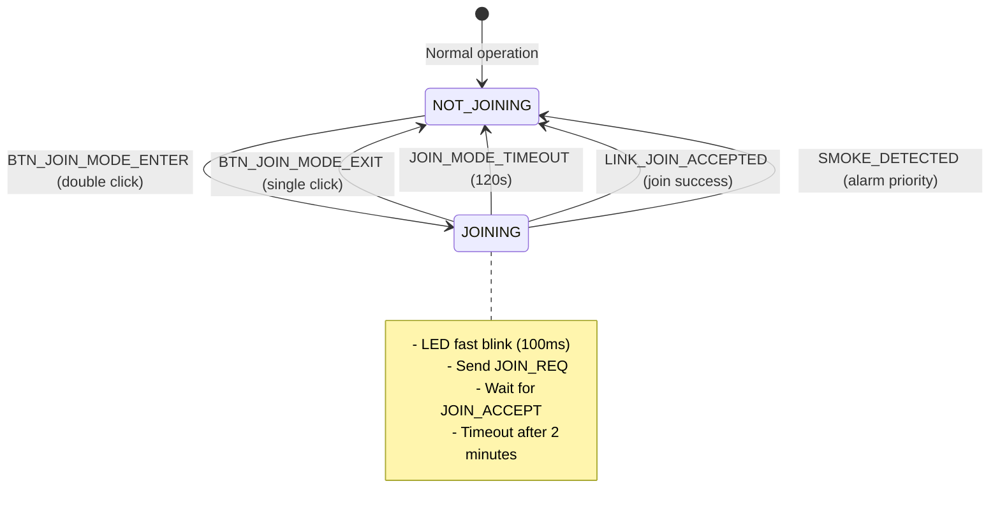
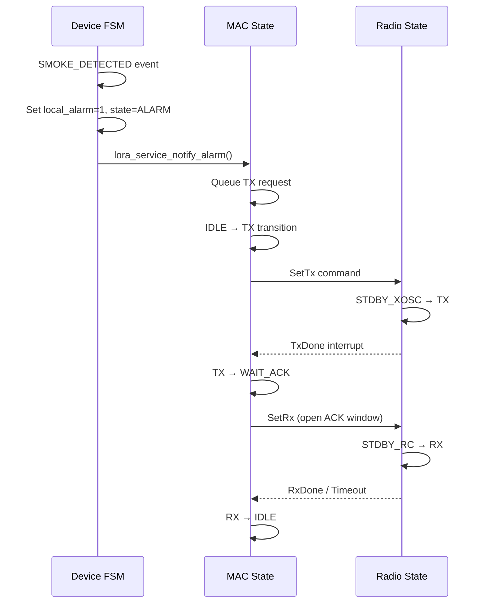
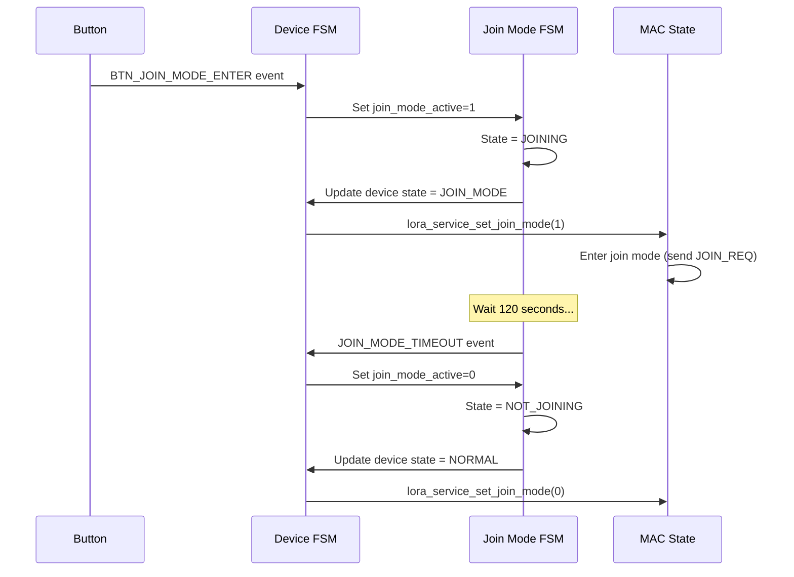

# EMIC LoRa State Machines Documentation

**Phiên bản:** 1.0.0  
**Ngày:** 20 Tháng 1, 2026  
**Mục đích:** Mô tả tất cả state machines trong firmware

---

## 📚 Related Documents

- [software_architecture.md](software_architecture.md) - System-wide software architecture
- [layer_call_flow.md](layer_call_flow.md) - Call flow and dependencies
- [critical_flows.md](critical_flows.md) - Flowcharts for critical operations

---

## 1. Overview

EMIC LoRa firmware có **4 state machines chính**:

| State Machine      | Module           | Purpose                          | States | Transitions    |
|--------------------|------------------|----------------------------------|--------|----------------|
| **Device FSM**     | `device_fsm`     | Application business logic       | 3      | Event-driven   |
| **MAC State**      | `lora_mac`       | MAC layer channel access         | 5      | Time-driven    |
| **Radio State**    | `sx1262`         | SX1262 radio hardware state      | 6      | Command-driven |
| **Join Mode FSM**  | `device_fsm`     | Join setup sub-state (2 minutes) | 2      | Timeout-driven |

---

## 2. Device FSM (Application Layer)

### 2.1. State Diagram



### 2.2. State Definitions

| State           | Enum Value          | Meaning                          | LED Pattern      | Buzzer        | Sleep Mode |
|-----------------|---------------------|----------------------------------|------------------|---------------|------------|
| **NORMAL**      | `DEVICE_STATE_NORMAL` (0) | No alarm, normal operation | Green slow blink | OFF           | STOP OK    |
| **JOIN_MODE**   | `DEVICE_STATE_JOIN_MODE` (1) | Joining network (setup) | Green fast blink | OFF           | HALT only  |
| **ALARM**       | `DEVICE_STATE_ALARM` (2) | Fire detected (local/remote) | Red solid        | Pattern ON    | HALT only  |

### 2.3. Transition Events

#### 2.3.1. Events → State Transitions

| Current State | Event                              | Next State  | Action                           |
|---------------|------------------------------------|-------------|----------------------------------|
| **NORMAL**    | `BTN_JOIN_MODE_ENTER`              | JOIN_MODE   | Enable join mode, fast LED blink |
| **NORMAL**    | `SMOKE_DETECTED`                   | ALARM       | Set local_alarm=1, notify GW     |
| **NORMAL**    | `LINK_REMOTE_ALARM_ON`             | ALARM       | Set remote_alarm=1, buzzer ON    |
| **NORMAL**    | `BTN_TEST_HOLD_ALARM_START`        | ALARM       | Test alarm mode                  |
| **JOIN_MODE** | `BTN_JOIN_MODE_EXIT`               | NORMAL      | Exit join mode manually          |
| **JOIN_MODE** | `JOIN_MODE_TIMEOUT`                | NORMAL      | Timeout after 2 minutes          |
| **JOIN_MODE** | `LINK_JOIN_ACCEPTED`               | NORMAL      | Join success → normal operation  |
| **JOIN_MODE** | `SMOKE_DETECTED`                   | ALARM       | Fire detected → alarm priority   |
| **ALARM**     | `SMOKE_CLEARED` + remote=0         | NORMAL      | Both alarms cleared              |
| **ALARM**     | `LINK_REMOTE_ALARM_OFF` + local=0  | NORMAL      | Both alarms cleared              |
| **ALARM**     | `SMOKE_DETECTED`                   | ALARM       | Stay in ALARM (refresh local)    |

#### 2.3.2. State Computation Logic

**Recomputation formula:**
```c
if ((remote_alarm != 0) || (local_alarm != 0)) {
    state = DEVICE_STATE_ALARM;
} else if (join_mode_active != 0) {
    state = DEVICE_STATE_JOIN_MODE;
} else {
    state = DEVICE_STATE_NORMAL;
}
```

### 2.4. Internal Flags

| Flag                | Type    | Purpose                              | Set By                  | Clear By                |
|---------------------|---------|--------------------------------------|-------------------------|-------------------------|
| `s_local_alarm`     | `uint8` | Local fire detected (smoke/test)     | SMOKE_DETECTED          | SMOKE_CLEARED           |
| `s_remote_alarm`    | `uint8` | Remote fire detected (from GW)       | LINK_REMOTE_ALARM_ON    | LINK_REMOTE_ALARM_OFF   |
| `s_smoke_active`    | `uint8` | Physical smoke sensor reading        | SMOKE_DETECTED          | SMOKE_CLEARED           |
| `s_test_hold_active`| `uint8` | Button held for alarm test           | BTN_TEST_HOLD_ALARM_START| BTN_TEST_HOLD_ALARM_STOP|
| `s_join_mode_active`| `uint8` | Join mode enabled                    | BTN_JOIN_MODE_ENTER     | BTN_JOIN_MODE_EXIT      |

### 2.5. Event Queue

**Capacity:** 8 events (ring buffer)  
**Thread safety:** Critical section (interrupt disable) for enqueue  
**Overflow behavior:** Drop oldest event (FIFO)

**Event flow:**
```
app_collect_events() → device_fsm_post_event() → s_queue[tail++]
                                                      ↓
                            device_fsm_run() ← s_queue[head++]
                                    ↓
                          device_fsm_handle_event()
                                    ↓
                          device_fsm_recompute_state()
```

### 2.6. Actions on State Transition

| Transition        | Actions                                                |
|-------------------|--------------------------------------------------------|
| NORMAL → ALARM    | - Record alarm timestamp to NV store (dataflash)       |
|                   | - Call `alarm_service_set_local_alarm(1)` or remote    |
|                   | - Call `lora_service_notify_alarm()` (TX alarm frame)  |
| ALARM → NORMAL    | - Flush NV store (persist counters)                    |
|                   | - Clear alarm outputs (buzzer OFF, LED normal)         |
| NORMAL → JOIN_MODE| - Set alarm_service joining indicator (LED fast blink) |
|                   | - Call `lora_service_set_join_mode(1)`                 |
| JOIN_MODE → NORMAL| - Clear joining indicator                              |
|                   | - Call `lora_service_set_join_mode(0)`                 |

---

## 3. MAC State Machine (MAC Layer)

### 3.1. State Diagram



### 3.2. State Definitions

| State        | Purpose                          | Radio Mode | Duration         | Next State       |
|--------------|----------------------------------|------------|------------------|------------------|
| **IDLE**     | Waiting for events               | STDBY/SLEEP| Indefinite       | CAD / TX         |
| **CAD**      | Channel Activity Detection       | RX (CAD)   | ~12 ms           | IDLE / RX        |
| **TX**       | Transmitting frame               | TX         | 50-200 ms        | WAIT_ACK / IDLE  |
| **WAIT_ACK** | Waiting for ACK response         | STDBY      | 120 ms           | RX / TX / IDLE   |
| **RX**       | Receiving frame                  | RX         | 120 ms           | IDLE / TX        |

### 3.3. State Transitions

**Triggers:**

| Transition        | Trigger                          | Condition                     | Action                     |
|-------------------|----------------------------------|-------------------------------|----------------------------|
| IDLE → CAD        | RTC tick (5s periodic)           | CAD scan period elapsed       | Start CAD                  |
| IDLE → TX         | Upper layer TX request           | Frame queued                  | Serialize frame, TX        |
| CAD → RX          | CAD positive                     | Preamble detected             | Continue RX                |
| CAD → IDLE        | CAD negative                     | No preamble                   | Back to IDLE               |
| TX → WAIT_ACK     | TX done                          | ACK_REQ=1                     | Open RX window (120ms)     |
| TX → IDLE         | TX done                          | ACK_REQ=0                     | TX complete                |
| WAIT_ACK → RX     | Timer                            | RX window open                | Listen for ACK             |
| RX → IDLE         | RX timeout / Frame received      | -                             | Process frame              |
| RX → TX           | ACK needed                       | Received frame has ACK_REQ=1  | Send ACK frame             |
| WAIT_ACK → TX     | Timeout + retry                  | retry_count < MAX_RETRY       | Retransmit (exp backoff)   |
| WAIT_ACK → IDLE   | Max retries                      | retry_count >= MAX_RETRY      | Give up, report failure    |

### 3.4. Timing Parameters

| Parameter             | Value   | Purpose                              |
|-----------------------|---------|--------------------------------------|
| CAD scan period       | 5000 ms | How often to check channel activity  |
| RX after CAD          | 120 ms  | RX window after CAD positive         |
| RX after TX           | 120 ms  | RX window for ACK after TX           |
| RX after JOIN         | 900 ms  | Extended RX for JOIN_ACCEPT          |
| Retry base delay      | 5 s     | Base retransmit interval             |
| Max retries           | 4       | Maximum retry attempts               |

### 3.5. Retry Logic

**Exponential backoff:**
```
Attempt 1: Immediate TX
Attempt 2: Wait 5s + jitter(0-3s) → TX
Attempt 3: Wait 10s + jitter(0-3s) → TX
Attempt 4: Wait 20s + jitter(0-3s) → TX
Attempt 5: Max retries → Give up
```

**Jitter:** Random 0-3 seconds to avoid collision

---

## 4. Radio State Machine (PHY Layer)

### 4.1. SX1262 State Diagram



### 4.2. State Definitions

| State         | Enum (internal)    | Current Draw | Purpose                         | Wake Time     |
|---------------|--------------------|--------------|---------------------------------|---------------|
| **SLEEP**     | `MODE_SLEEP`       | ~0.16 µA     | Deep sleep, config lost         | ~3.5 ms       |
| **STDBY_RC**  | `MODE_STDBY_RC`    | ~0.6 µA      | Standby with RC oscillator      | ~500 µs       |
| **STDBY_XOSC**| `MODE_STDBY_XOSC`  | ~0.8 µA      | Standby with crystal oscillator | ~100 µs       |
| **FS**        | `MODE_FS`          | ~1.2 µA      | Frequency synthesis             | N/A (transient)|
| **TX**        | `MODE_TX`          | ~22 mA       | Transmitting                    | ~100 µs       |
| **RX**        | `MODE_RX`          | ~4.6 mA      | Receiving                       | ~100 µs       |
| **CAD**       | `MODE_RX_DC`       | ~4.6 mA      | Channel activity detection      | ~100 µs       |

### 4.3. State Transitions (Command-Driven)

| Command             | From State(s)      | To State     | Purpose                          |
|---------------------|--------------------|--------------|----------------------------------|
| `SetSleep`          | STDBY_RC           | SLEEP        | Enter deep sleep (warm start)    |
| `SetStandby(RC)`    | SLEEP / STDBY_XOSC | STDBY_RC     | Wake from sleep / switch to RC   |
| `SetStandby(XOSC)`  | STDBY_RC           | STDBY_XOSC   | Crystal oscillator ready         |
| `SetFs`             | STDBY_RC           | FS           | Frequency synthesis (transient)  |
| `SetTx(timeout)`    | STDBY_XOSC         | TX           | Start transmitting               |
| `SetRx(timeout)`    | STDBY_XOSC         | RX           | Start receiving                  |
| `SetCad`            | STDBY_XOSC         | CAD          | Start CAD (preamble detection)   |

**Auto-transitions (hardware):**
- TX → STDBY_RC (TxDone interrupt)
- RX → STDBY_RC (RxDone / Timeout interrupt)
- CAD → STDBY_RC (CadDone interrupt)

### 4.4. Sleep Modes

| Sleep Mode      | Config Retention | Wake Source     | Current Draw | Wake Time | Use Case                  |
|-----------------|------------------|-----------------|--------------|-----------|---------------------------|
| **Cold start**  | Lost             | PIN (manual)    | ~0.16 µA     | ~3.5 ms   | Long idle (>10 minutes)   |
| **Warm start**  | Retained         | DIO1 (interrupt)| ~0.16 µA     | ~500 µs   | Normal operation (default)|

**Firmware uses warm start** (`retain_config=1`) để giữ RF config khi SLEEP.

---

## 5. Join Mode FSM (Sub-State of Device FSM)

### 5.1. State Diagram



### 5.2. State Definitions

| State           | Flag Value         | LED Pattern      | Behavior                         | Timeout |
|-----------------|--------------------|------------------|----------------------------------|---------|
| **NOT_JOINING** | `join_mode_active=0` | Normal (slow)   | Normal operation / ALARM         | N/A     |
| **JOINING**     | `join_mode_active=1` | Fast blink (100ms) | Send JOIN_REQ, wait JOIN_ACCEPT | 120 s   |

### 5.3. Transition Events

| Event                      | From State    | To State      | Action                          |
|----------------------------|---------------|---------------|---------------------------------|
| `BTN_JOIN_MODE_ENTER`      | NOT_JOINING   | JOINING       | Start join mode, fast LED blink |
| `BTN_JOIN_MODE_EXIT`       | JOINING       | NOT_JOINING   | Exit join mode manually         |
| `JOIN_MODE_TIMEOUT`        | JOINING       | NOT_JOINING   | Timeout after 2 minutes         |
| `LINK_JOIN_ACCEPTED`       | JOINING       | NOT_JOINING   | Join success → normal operation |
| `SMOKE_DETECTED`           | JOINING       | NOT_JOINING   | Fire detected → alarm priority  |

### 5.4. Join Mode Timeout

**Timer:** 120 seconds (2 minutes)  
**Implementation:** Check in `device_fsm_run()` every iteration  
**Action on timeout:** Exit join mode, return to NORMAL state

---

## 6. State Machine Interactions

### 6.1. Device FSM → MAC State



### 6.2. Join Mode FSM → Device FSM



---

## 7. State Machine Implementation Details

### 7.1. Device FSM Implementation

**File:** `src/user/app/device_fsm.c`

**Key data structures:**
```c
static device_state_t s_state;              // Current FSM state
static uint8_t s_local_alarm;               // Local alarm flag
static uint8_t s_remote_alarm;              // Remote alarm flag
static uint8_t s_join_mode_active;          // Join mode flag
static device_event_t s_queue[8];           // Event queue (ring buffer)
```

**State computation:**
```c
void device_fsm_recompute_state(void) {
    if ((s_remote_alarm != 0) || (s_local_alarm != 0)) {
        s_state = DEVICE_STATE_ALARM;
    } else if (s_join_mode_active != 0) {
        s_state = DEVICE_STATE_JOIN_MODE;
    } else {
        s_state = DEVICE_STATE_NORMAL;
    }
}
```

### 7.2. MAC State Implementation

**File:** `src/user/mac/lora_mac.c`

**State tracking:** Internal state variable `s_mac_state`

**State transition wrapper:**
```c
void mac_set_state(mac_state_t new_state) {
    s_mac_state = new_state;
    // Log transition (debug)
}
```

### 7.3. Radio State Implementation

**File:** `src/user/radio/sx1262.c`

**State commands:**
```c
void sx1262_set_sleep(uint8_t warm_start);
void sx1262_set_standby(uint8_t mode);  // RC or XOSC
void sx1262_set_fs();
void sx1262_set_tx(uint32_t timeout_ms);
void sx1262_set_rx(uint32_t timeout_ms);
void sx1262_set_cad();
```

**IRQ handling:**
```c
void radio_if_process_irq() {
    uint16_t irq_status = sx1262_get_irq_status();
    
    if (irq_status & IRQ_TX_DONE) {
        mac_on_tx_done();
    }
    if (irq_status & IRQ_RX_DONE) {
        mac_on_rx_done();
    }
    if (irq_status & IRQ_CAD_DONE) {
        mac_on_cad_done(cad_detected);
    }
}
```

---

## 8. State Machine Best Practices

### 8.1. Design Principles

1. **Single Responsibility:** Each state machine handles one concern
   - Device FSM: Application logic (alarm/join)
   - MAC State: Channel access
   - Radio State: Hardware control

2. **Event-Driven:** Device FSM uses event queue (no polling)

3. **Time-Driven:** MAC state uses timers (RTC tick, RX window)

4. **Command-Driven:** Radio state responds to explicit commands

### 8.2. Common Pitfalls

❌ **Don't:**
- Call blocking functions in FSM handlers (e.g., `delay()`, `while()`)
- Mix state machine concerns (e.g., Device FSM controlling radio directly)
- Ignore state validation (always check current state before action)

✅ **Do:**
- Keep handlers short (<50 lines)
- Use guard conditions (`if (state == X) return;`)
- Log state transitions (debug builds)
- Handle all possible events in all states (even if no-op)

---

## 9. State Machine Testing

### 9.1. Test Strategy

| Level         | Focus                          | Tools                     |
|---------------|--------------------------------|---------------------------|
| Unit          | Individual state transitions   | Mock HAL, state assertions|
| Integration   | State machine interactions     | Logic analyzer, debugger  |
| System        | End-to-end scenarios           | RF sniffer, multi-device  |

### 9.2. Key Test Scenarios

**Device FSM:**
- [ ] NORMAL → ALARM transition (smoke detected)
- [ ] ALARM → NORMAL transition (both alarms cleared)
- [ ] NORMAL → JOIN_MODE → NORMAL (timeout)
- [ ] Event queue overflow (8+ events)

**MAC State:**
- [ ] CAD → RX → IDLE (frame received)
- [ ] TX → WAIT_ACK → RX → IDLE (ACK received)
- [ ] TX → WAIT_ACK → Retry → TX (no ACK, retry)
- [ ] Max retries exhausted (4 attempts)

**Radio State:**
- [ ] SLEEP → STDBY_RC → STDBY_XOSC → TX (wake and transmit)
- [ ] TX → STDBY_RC (TxDone interrupt)
- [ ] Warm start SLEEP retention (config preserved)

---

## 10. State Machine Debugging

### 10.1. Debug Tools

**State logging:**
```c
#ifdef DEBUG_BUILD
  #define STATE_LOG(fmt, ...) log_debug("[FSM] " fmt, ##__VA_ARGS__)
#else
  #define STATE_LOG(fmt, ...)
#endif

void device_fsm_recompute_state() {
    device_state_t prev = s_state;
    // ... recompute ...
    if (prev != s_state) {
        STATE_LOG("State: %s -> %s", state_name(prev), state_name(s_state));
    }
}
```

**LED indicators:**
- Fast blink: JOIN_MODE
- Slow blink: NORMAL
- Solid: ALARM

### 10.2. Common Issues

| Issue                        | Symptoms                     | Debug Approach                |
|------------------------------|------------------------------|-------------------------------|
| State stuck                  | FSM doesn't transition       | Log events, check guards      |
| Event loss                   | Events don't trigger actions | Check queue overflow          |
| Race condition               | Inconsistent state           | Check critical sections       |
| Radio not responding         | TX/RX timeout                | Check SPI, DIO1 ISR           |

---

## 11. Future Enhancements

### 11.1. Planned Features

- [ ] Add OFFLINE state (GW lost for >5 minutes)
- [ ] Add LOW_BATT state (battery <2.4V)
- [ ] Implement sleep scheduling FSM (beacon sync)
- [ ] Add FAULT state (sensor malfunction)

### 11.2. State Machine Visualization Tool

**Concept:** Python script to generate state diagrams from code

```bash
python tools/visualize_fsm.py src/user/app/device_fsm.c -o docs/image/device_fsm.png
```

---

**Document Status:** ✅ Ready for Review  
**Next Review:** 2026-02-20
